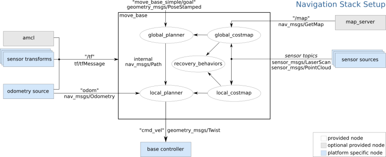
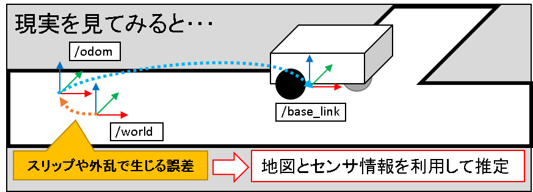
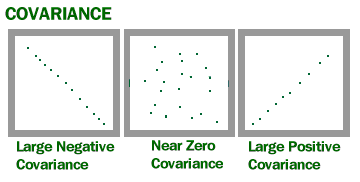
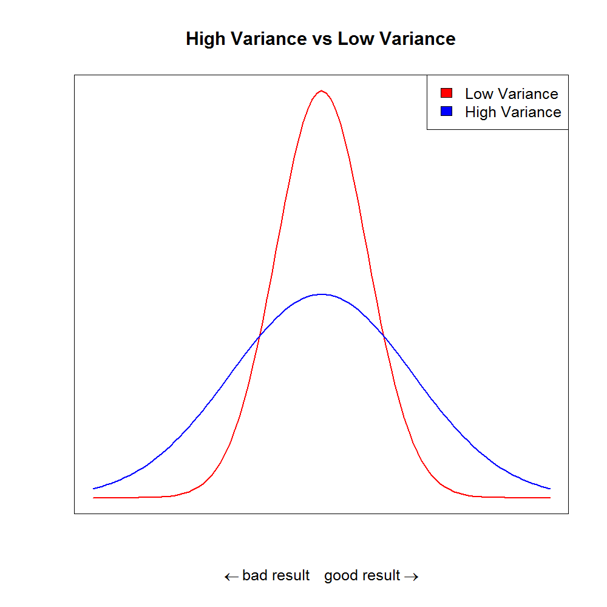
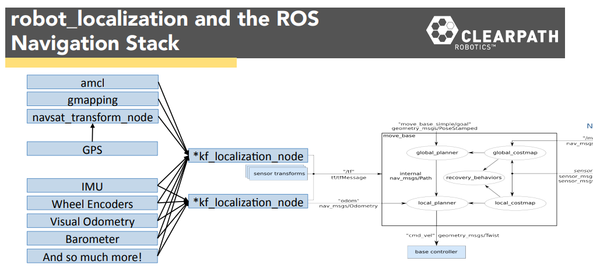
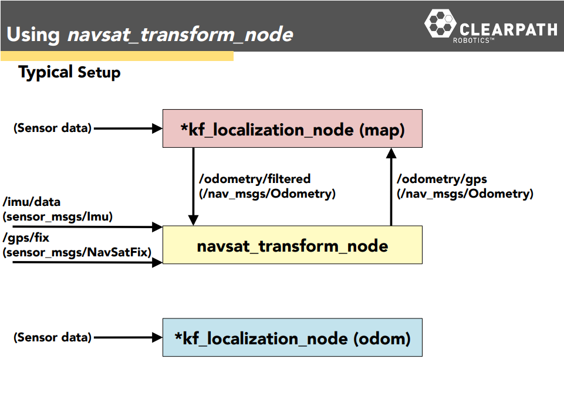

## Sensor Fusion with ROS

Author: github.com/methylDragon    
A tutorial for sensor fusion using the robot_localization package! (With explanations of the pre-requisite concepts!)

https://www.youtube.com/watch?v=nfvvpYBAMww&t=198s

---

## Pre-Requisites

### Good to know

- ROS + Catkin (to understand the Interface notes)
- Linux Terminal

## Table Of Contents <a name="top"></a>

1. [Introduction](#1)  
2. [Concepts](#2)    
   2.1   [ROS Nav Stack Refresher](#2.1)    
   2.2   [Map, Odom, and base_link](#2.2)    
   2.3   [Kalman Filters and The Motivations for Sensor Fusion](#2.3)    
   2.4   [Covariance](#2.4)    
3. [Practical Sensor Fusion with robot_localization](#3)    
   3.1   [Introduction to robot_localization](#3.1)    
   3.2   [Roadmap](#3.2)    
   3.3   [Preparing your Data](#3.3)    
   3.4   [Configuring the Kalman Filter Nodes](#3.4)    
   3.5   [Best Practices for Sensor Fusion](#3.5)    
   3.6   [Some Handy Configuration Parameters](#3.6)    
   3.7   [Fusing GPS Data](#3.7)    
   3.8   [rosbag](#3.8)    


## 1. Introduction <a name="1"></a>

The robot_localisation package in ROS is a very useful package for fusing any number of sensors using various flavours of Kalman Filters!

Kalman Filter concept: https://www.youtube.com/watch?v=bm3cwEP2nUo

We're going to use it to fuse global Pose data (x, y, z, and orientation) with the existing sensors on a robot to achieve more robust localisation!


## 2. Concepts <a name="2"></a>

### 2.1 ROS Nav Stack Refresher <a name="2.1"></a>

[go to top](#top)



Source: http://wiki.ros.org/move_base

Pay attention to the left side of the image (on the /tf and odom messages being sent.)

The navigation stack localises robots using continuous and discontinuous odometry (a message type combining twist (velocity) and pose (position) messages), and transform messages from the different sensors and global pose estimators.

In other words, the odometry data (gathered from sensors), and pose estimates (from AMCL), as well as any other additional sensors you might want to add will contribute to the nav stack's localisation efforts (if properly configured.)


### 2.2 Map, Odom, and base_link <a name="2.2"></a>

[go to top](#top)

There are two kinds of pose estimates, one for the robot's local position (which is continuous and drifts over time), and one of the robot's estimated position globally (which is discontinuous but more accurate in the long run).

And these pose estimates affect **different** transforms between the three coordinate frames of the map, odom and base_link frames.



Image source: hi58.net

(**NOTE:** /world is depreciated! It is not the proper way to name the map coordinate frame according to REP 105. **You should be using /map instead!**)

I know the image is a little bit japanese, but... The idea is that the base_link frame is a child of the odom frame, which is a child of the map frame.

So, there are two transforms at play.

> 1. map -> odom
>    - **Accounts for the robot's global pose**
>    - Tracks the offset needed to compensate for overall sensor drift as the robot drives around, allowing the robot to more robustly create global path plans
>    - Is **discontinuous** (jumps around)
>    - Is published by the **AMCL node** (or any other global pose estimators!)
>    
> 2. odom -> base_link
>    - **Accounts for the robot's local pose**
>    - Is best for local obstacle avoidance
>    - Is **continuous**, but drifts over time due to sensor drift
>    - Is published by the **odometry node** (which should be taking into account encoders, IMUs and other sensors like laser scan matching nodes, etc.)


### 2.3 Kalman Filters and The Motivations for Sensor Fusion <a name="2.3"></a>

[go to top](#top)

Clearly, because we live in the real world, our sensors are going to fail due to noise, and our algorithms will sometimes mess up (actually they like to mess up most of the time...)

The way to solve this issue is to introduce **redundancy** to our systems, since it is less likely for multiple sensors to fail all at once!


#### **The Simple Example**

For example, let's say we have a binary state we want to keep track of:

- A
- B

Let's say we have 4 sensors that can track it. If each sensor has a failure rate of 20%.

So if we have sensor readings that look like this:

> AABA,
>
> BBBB,
>
> BBBA,
>
> ABBB

It's kind of obvious what the 'correct' measurement is, at least most of the time, innit.


#### **Making it more complete**

Of course, you're not going to have binary readings, and you're definitely not going to have the same failure rates for your sensors (or heck, even the same failure rates for different axes of your sensors!)


Let's say we have four sensors, taking **continuous** values along 3 axes, x, y, and z (we'll separate the readings using the | modulus sign):

>  x: 0.214 | 0.31123 | 0.413 | 0.215
>
> y: 0.012 | -1.21415 | 2.125 | 0.5421
>
> z: 0.00124 | 0.000 | -12.124124 | 5.0124

How the heck do you even get a good estimated value for this data!? I mean, you could technically just do an average, but that's not exactly very robust or intelligent...


**BEHOLD!** WELCOME TO

```

   ▄█   ▄█▄    ▄████████  ▄█          ▄▄▄▄███▄▄▄▄      ▄████████ ███▄▄▄▄   
  ███ ▄███▀   ███    ███ ███        ▄██▀▀▀███▀▀▀██▄   ███    ███ ███▀▀▀██▄ 
  ███▐██▀     ███    ███ ███        ███   ███   ███   ███    ███ ███   ███ 
 ▄█████▀      ███    ███ ███        ███   ███   ███   ███    ███ ███   ███ 
▀▀█████▄    ▀███████████ ███        ███   ███   ███ ▀███████████ ███   ███ 
  ███▐██▄     ███    ███ ███        ███   ███   ███   ███    ███ ███   ███ 
  ███ ▀███▄   ███    ███ ███▌    ▄  ███   ███   ███   ███    ███ ███   ███ 
  ███   ▀█▀   ███    █▀  █████▄▄██   ▀█   ███   █▀    ███    █▀   ▀█   █▀  
  ▀                      ▀                                                 
   ▄████████  ▄█   ▄█           ███        ▄████████    ▄████████          
  ███    ███ ███  ███       ▀█████████▄   ███    ███   ███    ███          
  ███    █▀  ███▌ ███          ▀███▀▀██   ███    █▀    ███    ███          
 ▄███▄▄▄     ███▌ ███           ███   ▀  ▄███▄▄▄      ▄███▄▄▄▄██▀          
▀▀███▀▀▀     ███▌ ███           ███     ▀▀███▀▀▀     ▀▀███▀▀▀▀▀            
  ███        ███  ███           ███       ███    █▄  ▀███████████          
  ███        ███  ███▌    ▄     ███       ███    ███   ███    ███          
  ███        █▀   █████▄▄██    ▄████▀     ██████████   ███    ███          
                  ▀                                    ███    ███          
 ▄████████  ▄█      ███     ▄██   ▄                                        
███    ███ ███  ▀█████████▄ ███   ██▄                                      
███    █▀  ███▌    ▀███▀▀██ ███▄▄▄███                                      
███        ███▌     ███   ▀ ▀▀▀▀▀▀███                                      
███        ███▌     ███     ▄██   ███                                      
███    █▄  ███      ███     ███   ███                                      
███    ███ ███      ███     ███   ███                                      
████████▀  █▀      ▄████▀    ▀█████▀                                       
                                                                           
```


#### **Kalman Filters**

Don't know what this is? No worries, here's a basic video explaining it: https://www.youtube.com/watch?v=bm3cwEP2nUo    
Or this: http://www.bzarg.com/p/how-a-kalman-filter-works-in-pictures/


Kalman filters allow you to:

- Fuse **continuous numerical data**
- Take into account the **uncertainties along multiple axes of your sensors**


robot_localisation in particular (the node we will be using to fuse our data) provides two kinds of kalman filter nodes (Extended Kalman Filter, and Unscented Kalman Filter (EKF and UKF))

- UKFs are slower but more accurate for non-linear transformations
- EKFs are faster though!
  - But more importantly, according to https://www.sciencedirect.com/science/article/pii/S0921889015001517?via%3Dihub , EKFs are just as effective as UKFs for sensor fusion, so just use EKFs when fusing nav data for ROS


All in all, just remember that EKFs and UKFs are riffs on the original kalman filter concept! If you want to go in deeper... You're going to have to look somewher else... But it's all mostly probability and statistics!


### 2.4 Covariance <a name="2.4"></a>

[go to top](#top)

Covariance is the tendency for two variables to **vary together**, which is a way of being correlated!



Image Source: University of Wisconsin

The image should speak volumes already (just remember that in the image, the x and y axes represent two different variables.) I don't think going into the math is required at this stage, but do go look it up if you're interested.

Since we are dealing with Kalman Filters, and specifically robot_localization, we are concerned with 15 different variables, and so, it becomes a lot more convenient to represent the covariances between each variable as **a covariance matrix.**

```
[0.05, 0,    0,    0,    0,    0,    0,     0,     0,    0,    0,    0,    0,    0,    0,
 0,    0.05, 0,    0,    0,    0,    0,     0,     0,    0,    0,    0,    0,    0,    0,
 0,    0,    0.06, 0,    0,    0,    0,     0,     0,    0,    0,    0,    0,    0,    0,
 0,    0,    0,    0.03, 0,    0,    0,     0,     0,    0,    0,    0,    0,    0,    0,
 0,    0,    0,    0,    0.03, 0,    0,     0,     0,    0,    0,    0,    0,    0,    0,
 0,    0,    0,    0,    0,    0.06, 0,     0,     0,    0,    0,    0,    0,    0,    0,
 0,    0,    0,    0,    0,    0,    0.025, 0,     0,    0,    0,    0,    0,    0,    0,
 0,    0,    0,    0,    0,    0,    0,     0.025, 0,    0,    0,    0,    0,    0,    0,
 0,    0,    0,    0,    0,    0,    0,     0,     0.04, 0,    0,    0,    0,    0,    0,
 0,    0,    0,    0,    0,    0,    0,     0,     0,    0.01, 0,    0,    0,    0,    0,
 0,    0,    0,    0,    0,    0,    0,     0,     0,    0,    0.01, 0,    0,    0,    0,
 0,    0,    0,    0,    0,    0,    0,     0,     0,    0,    0,    0.02, 0,    0,    0,
 0,    0,    0,    0,    0,    0,    0,     0,     0,    0,    0,    0,    0.01, 0,    0,
 0,    0,    0,    0,    0,    0,    0,     0,     0,    0,    0,    0,    0,    0.01, 0,
 0,    0,    0,    0,    0,    0,    0,     0,     0,    0,    0,    0,    0,    0,   0.1]
```


#### **Simple Example**

To understand this crazy thing, maybe it'll be better to do it with a simpler example.

```
   x  y  z
x [a, b, c,
y  d, e, f
z  g, h, i]
```

As we can see, now we have the covariance matrix for the variables x, y, and z.

For any particular row and column, the number in the matrix represents the **covariance of the variables represented by said row and column.**

Eg. 

- b represents the covariance of (x, y)
- a represents the covariance of (x, x)


#### **Variances**

Hold up a bit though. Did someone say covariance of x and x!?



Image Source: MTG Salvation <-- NERDDD

Turns out, the covariance of x and x is just the variance of x. (I.E. the **spread** of values of x, and hence the 'uncertainty' or 'noisiness' of x.)


#### **Covariance Matrix Properties**

If you're sharp enough, you'd have picked up on several things just from observing the simple example.

For example, you'd reasonably expect the covariance of x, y and y, x to be the same! And this is true! The covariance matrix is symmetrical!


Here are some of the more pertinent properties, **covariance matrices are:**

- Symmetric (and square)
- Matrices that contain real numbers only
- Positive Semi-definite
  - I.E. the diagonals (a, e, i for 3x3) are all positive, but non-diagonals can be any real value
  - Because variances can't be negative!


#### **Practical Takeaways**

Maybe refresh on this again: http://www.bzarg.com/p/how-a-kalman-filter-works-in-pictures/

So, if you were to pass a covariance matrix to a Kalman Filter, the most important values are actually the variance values (the diagonals from top left to bottom right.)


1. The variances determine how 'trustworthy' the sensor is for a particular axis!
2. **<u>Higher variance ➡ More noisy/uncertain ➡ Less trustworthy ➡ Kalman Filter will regard the sensor's reading less!</u>**
3. Tuning your measurement covariance matrix for each sensor is SUPER IMPORTANT! So is tuning your initial covariance estimates, as well as process noise covariance matrix.


Additionally: **You know your covariances are tuned properly if they're converging over time (or better, vanishing!)**

If they're exploding, you're just going to destroy the reliability of your data...


## 3. Practical Sensor Fusion with robot_localization <a name="3"></a>

### 3.1 Introduction to robot_localization <a name="3.1"></a>

[go to top](#top)

robot_localization API reference: http://docs.ros.org/melodic/api/robot_localization/html/    
ROScon Presentation: https://www.youtube.com/watch?v=nfvvpYBAMww    
And slides: https://roscon.ros.org/2015/presentations/robot_localization.pdf


Luckily for us, ROS has a ready made package for fusing (**any number of**) sensor and pose estimate data sources via EKFs or UKFs in the form of the robot_localization package!


It has cool features such as:

1. Two choices of kalman filter to use (EKF and UKF)
2. Fusing any number of input sensor and pose estimate data sources
	- As long as they have valid message types (odometry, imu, pose, and twist)
3. The ability to ignore data from sensors
4. Continuous estimation in the absence of continuous data
5. Data 'pre-processing'
	- Eg: Integrating velocity data to generate an estimate of distance data
6. Integration of 15 states:
	- Position: x, y, z
	- Orientation: yaw, pitch, roll
	- Linear Velocity: x', y', z'
	- Angular Velocity: yaw', pitch', roll'
	- Linear Acceleration: x'', y'', z'' 


I'll go through the more important features and configurations, but for the full experience, just read the code API, it's pretty well documented.


#### **robot_localization Usage (The Big Picture)**



Image source: Clearpath Robotics (ROScon 2015 robot_localization presentation)

So, remember we have the **map**, **odom**, and **base_link** frames to keep track of?

- The map -> odom transform is dealt with via /tf
- The odom -> base_link transform is dealt with via an odometry message sent via "odom", as per convention.

So, naturally, you'd want to fuse data to cater to these two transforms!


**Fusing Sensors for the /map frame (map -> odom)**

> **For map -> odom** you need an ekf/ukf_localization_node with the node's **"world_frame" parameter set to the name of your map frame.**
>
> It fuses:
>
> - All continuous sensor data and algorithm outputs that aren't global pose estimates
>   - Yes! This is actually the case! **Non-global sensor and algorithm data is used in the global pose Kalman Filter!**
> - Global pose estimates, for example...
>   - AMCL (or other localisation algorithms)
> - Absolute global pose data, for example...
>   - GPS (after using navsat: http://docs.ros.org/melodic/api/robot_localization/html/navsat_transform_node.html)
>   - Ultrasonic beacons (we're going to fuse these!)
>   - Global Visual Odometry (from an overhead camera, perhaps?)

**Fusing Sensors for the /odom frame (odom -> base_link)**

> **For odom -> base_link** you need an ekf/ukf_localization_node with the node's **"world_frame" parameter set to the name of your odom frame.**
>
> It fuses:
>
> - All continuous sensor data and algorithm outputs that aren't global pose estimates, for example...
>   - IMU
>   - Visual Odometry
>   - Wheel Encoders
>   - laser_scan_matcher (Using lasers to derive a local robot odometry) (or ICP!)


### 3.2 Roadmap <a name="3.2"></a>

[go to top](#top)

For this example we're going to be using an EKF localisation node.

We're going to need **two things to get started** (aside from our data sources and other algos).

1. ekf_template.yaml (for the parameters)
2. ekf_template.launch (for loading the parameters)

You should find these in the param and launch folders in the robot_localization package. They're fairly self explanatory.

Just remember to load in your parameters using roslaunch!

Remember to NOT remap odometry/filtered to /odom, unless you like recursion for some reason... It's **better practice** to remap the input topics for nodes downstream of the Kalman Filter nodes.

```yaml
<launch>
  <node pkg="robot_localization" type="ekf_localization_node" name="ekf_se" clear_params="true">
    <rosparam command="load" file="$(find robot_localization)/params/ekf_template.yaml" />

   <!--  Placeholder for output topic remapping
     You either remap on this node, the node that takes in the data, or both!
     <remap from="odometry/filtered" to=""/>
     <remap from="accel/filtered" to=""/>
     -->

  </node>
</launch>
```


#### **Step-By-Step**

Then we can move on! Integrating the EKF or UKF from robot_localization is easy! You just need to set things up properly, so I'll list the relevant steps here!

1. Prepare your data
2. Configure the Kalman Filter nodes
3. Run, validate, and tune!

If you want to fuse GPS data, you're going to have to also use an additional node called navsat_transform_node, to transform the GPS data into something more easily worked with. Details will come later.


### 3.3 Preparing your Data  <a name="3.3"></a>

[go to top](#top)

Read more: http://docs.ros.org/melodic/api/robot_localization/html/preparing_sensor_data.html#

robot_localization attempts to adhere to the following ROS standards, so it would be good to ensure that your data also follows the conventions:

- [REP-103 (Standard Units of Measure and Coordinate Conventions)](http://www.ros.org/reps/rep-0103.html)
- [REP-105 (Coordinate Frame Conventions)](http://www.ros.org/reps/rep-0105.html)

Additionally, only the following message types can be used as inputs to robot_localization nodes:

- [nav_msgs/Odometry](http://docs.ros.org/api/nav_msgs/html/msg/Odometry.html)
  - Position, Orientation, and Velocity
- [geometry_msgs/PoseWithCovarianceStamped](http://docs.ros.org/api/geometry_msgs/html/msg/PoseWithCovarianceStamped.html)
  - Position and Orientation
- [geometry_msgs/TwistWithCovarianceStamped](http://docs.ros.org/api/geometry_msgs/html/msg/TwistWithCovarianceStamped.html)
  - Velocity
- [sensor_msgs/Imu](http://docs.ros.org/api/sensor_msgs/html/msg/Imu.html)
  - Angular Velocity and Linear Acceleration


#### **Best Practices: Odometry, Pose, and Twist**

The robot_localization documentation presents several recommendations for using odometry (and related) data.


**1. Ensure that your frame_id and child_frame_id is configured correctly**

Recall the section about Map, Odom, and base_link? Those are the coordinate frames you should be using.

Most odometry sources tend to be configured as follows, though. But just use what actually makes sense, according to the context:

- frame_id: odom
- child_frame_id: base_link


**2. Ensure your data's signs are correct**

This one should be fairly self explanatory.

If your robot is moving counter-clockwise, yaw should be positive.

If your robot is moving forward, x should be positive.

Check [REP-103](http://www.ros.org/reps/rep-0103.html) and follow it!


**3. Remove any other sources of the odom -> base_link transform**

This is super important! Clashing transform publishes either crash the system or cause the robot's sense of its own position to oscillate wildly! (This is one of many possible reasons for position oscillation, so to avoid having a hell of a ride trying to find out the problem, make sure you resolve this first!)

You **MUST** disable all other transform publishers of the odom -> base_link transform if you want the robot_localization node that is responsible for odometry fusing to be in charge of the publishing.

This is also the case with the map -> odom transform! (Eg. the AMCL node, set its parameter tf_broadcast to false)


**4. Do not abuse your covariances**

Sometimes you might have to estimate your covariances with static values. Sometimes it'll make more sense to calculate them as you go along (I'm personally not sure how to do that, and static values seem to work well enough.)

But you should NEVER make artificially large values in your covariance matrix to try to get the Kalman filter to ignore the value. There's a parameter exposed for robot_localization for a reason!


#### **Best Practices: IMU**

Same deal here.


**1. Ensure your frame_id and signs are correct**

Same deal with the odom, pose, and twist messages! It's very, very important that you get this right!

> **SUPER IMPORTANT:**
>
> [sensor_msgs/Imu](http://docs.ros.org/api/sensor_msgs/html/msg/Imu.html) - The IMU message is currently subject to some ambiguity, though this is being addressed by the ROS community. Most IMUs natively report orientation data in a world-fixed frame whose X and Z axes are defined by the vectors pointing to magnetic north and the center of the earth, respectively, with the Y axis facing east (90 degrees offset from the magnetic north vector). This frame is often referred to as NED (North, East, Down). 
>
> However, [REP-103](http://www.ros.org/reps/rep-0103.html) specifies an ENU (East, North, Up) coordinate frame for outdoor navigation. As of this writing, `robot_localization` assumes an ENU frame for all IMU data, and does not work with NED frame data. This may change in the future, **but for now, users should ensure that data is transformed to the ENU frame before using it** with any node in `robot_localization`.
>
> (http://docs.ros.org/melodic/api/robot_localization/html/preparing_sensor_data.html#)


**2. Do not abuse your covariances**

Same deal here!

You'll have to find the covariance matrix for the components of the IMU you're using though! Get them from the data sheets, and input the variances so that the IMU can be used properly.


**3. Be wary of gravity**

IMUs also take into account gravitational acceleration, so you need to make sure your IMU is oriented properly.

If it does not, there is a parameter on the localization nodes that allow you to ask them to ignore gravitational acceleration.

Otherwise, robot_localization assumes that the IMU is placed upright.

> An IMU that is placed in its neutral *right-side-up*position on a flat surface will:
>
> - Measure **+**9.81 meters per second squared for the Z axis.
>
> - If the sensor is rolled **+**90 degrees (left side up), the acceleration should be **+**9.81 meters per second squared for the Y axis.
>
> - If the sensor is pitched **+**90 degrees (front side down), it should read **-**9.81 meters per second squared for the X axis.
>
> (http://docs.ros.org/melodic/api/robot_localization/html/preparing_sensor_data.html#)

If your IMU is not placed right side up, be sure to include a transform from base_link to the IMU's frame using a static transform.


#### **Common Errors**

Source: http://docs.ros.org/melodic/api/robot_localization/html/preparing_sensor_data.html#

> - Input data doesn’t adhere to [REP-103](http://www.ros.org/reps/rep-0103.html). Make sure that all values (especially orientation angles) increase and decrease in the correct directions.
>
>   
>
> - Incorrect `frame_id` values. Velocity data should be reported in the frame given by the `base_link_frame` parameter, or a transform should exist between the `frame_id`of the velocity data and the `base_link_frame`.
>
>   
>
> - Inflated covariances. The preferred method for ignoring variables in measurements is through the `odomN_config` parameter.
>
>   
>
> - Missing covariances. If you have configured a given sensor to fuse a given variable into the state estimation node, then the variance for that value (i.e., the covariance matrix value at position (i,i), where i is the index of that variable) should **not** be 0. If a 0 variance value is encountered for a variable that is being fused, the state estimation nodes will add a small epsilon value (1e−6) to that value. A better solution is for users to set covariances appropriately.


### 3.4 Configuring the Kalman Filter Nodes <a name="3.4"></a>

[go to top](#top)

There are a whooooole lot of optional parameters that you can use to customise your sensor fusion nodes. But some are more important than others. Let's go through the flow together!


#### **1. Choose whether you want an EKF or a UKF**

EKFs are generally used for robot localisation tasks, so let's use them for this example.

Just launch the relevant node in the launch file! And remember to load your parameters!

```yaml
<launch>
  <node pkg="robot_localization" type="ekf_localization_node" name="ekf_node_name" clear_params="true">
    <rosparam command="load" file="$(find robot_localization)/params/ekf_template.yaml" />

   <!--  Placeholder for output topic remapping
    <remap from="odometry/filtered" to=""/>
    <remap from="accel/filtered" to=""/>
    -->

  </node>
</launch>
```


#### **2. Specify your frames**

Let's follow the conventions laid out in [REP-105](http://www.ros.org/reps/rep-0105.html) here in our parameter .yaml file.

If fusing odometry data (scan matching, LIDAR, encoders, etc.):

```yaml
map_frame: map              # Defaults to "map" if unspecified
odom_frame: odom            # Defaults to "odom" if unspecified
base_link_frame: base_link  # Defaults to "base_link" if unspecified
world_frame: odom           # Defaults to the value of odom_frame if unspecified
```

If fusing global pose estimates (AMCL, beacons, etc.)

```yaml
map_frame: map              # Defaults to "map" if unspecified
odom_frame: odom            # Defaults to "odom" if unspecified
base_link_frame: base_link  # Defaults to "base_link" if unspecified
world_frame: map           # Defaults to the value of odom_frame if unspecified
```


#### **3. Specify your sensor inputs**

Make sure your sensor nodes are publishing valid messages! If you recall there are four eligible messages, and so, four ways to specify sensor/data inputs.

robot_localization enumerates them from 0.

```yaml
odom0: odom0_topic/odom # Fill in the correct topic here!
odom1: odom1_topic/odom # Make sure it's of the correct message type!

pose0: pose0_topic/pose # Same-same
pose1: pose1_topic/pose

twist0: twist0_topic # But different
twist1: twist1_topic

imu0: imu0_topic # But STILL same
imu1: imu1_topic
```


#### **4. Configure the data to use for each sensor**

Here's the canonical data vector. It's made of **booleans.**

**Canonical Data Vector**

```
[x_pos   , y_pos    , z_pos,
 roll    , pitch    , yaw,
 x_vel   , y_vel    , z_vel,
 roll_vel, pitch_vel, yaw_vel,
 x_accel , y_accel  , z_accel]
```

So to configure a sensor...

```yaml
odom0_config: [true,  true,  false,
               false, false, false,
               false, false, false,
               false, false, true,
               false, false, false]
               
# We can see that this sensor's x, y, and yaw_vel values are being used
```

> NOTE:    
> **For a planar robot, you should configure your sensors such that at least x, y, x_vel, y_vel, yaw, and yaw_vel are covered amongst all of them.**
>
> For a non-planar robot, or even a drone, you should preferably be covering at least everything except the acceleration values. But they ALL HELP.


#### **5. Specify your covariance matrices**

There are two covariance matrices to specify. The process noise (measurement noise) and initial estimate covariance matrices.

You should tune this!

```yaml
# [ADVANCED] The process noise covariance matrix can be difficult to tune, and can vary for each application, so it is exposed as a configuration parameter. This matrix represents the noise we add to the total error after each prediction step. 

# The better the omnidirectional motion model matches your system, the smaller these values can be. However, if users find that a given variable is slow to converge, one approach is to increase the process_noise_covariance diagonal value for the variable in question, which will cause the filter's predicted error to be larger, which will cause the filter to trust the incoming measurement more during correction. 

# The values are ordered as x, y, z, roll, pitch, yaw, vx, vy, vz, vroll, vpitch, vyaw, ax, ay, az. 
# Defaults to the matrix below if unspecified.

process_noise_covariance: [0.05, 0,    0,    0,    0,    0,    0,     0,     0,    0,    0,    0,    0,    0,    0,
                           0,    0.05, 0,    0,    0,    0,    0,     0,     0,    0,    0,    0,    0,    0,    0,
                           0,    0,    0.06, 0,    0,    0,    0,     0,     0,    0,    0,    0,    0,    0,    0,
                           0,    0,    0,    0.03, 0,    0,    0,     0,     0,    0,    0,    0,    0,    0,    0,
                           0,    0,    0,    0,    0.03, 0,    0,     0,     0,    0,    0,    0,    0,    0,    0,
                           0,    0,    0,    0,    0,    0.06, 0,     0,     0,    0,    0,    0,    0,    0,    0,
                           0,    0,    0,    0,    0,    0,    0.025, 0,     0,    0,    0,    0,    0,    0,    0,
                           0,    0,    0,    0,    0,    0,    0,     0.025, 0,    0,    0,    0,    0,    0,    0,
                           0,    0,    0,    0,    0,    0,    0,     0,     0.04, 0,    0,    0,    0,    0,    0,
                           0,    0,    0,    0,    0,    0,    0,     0,     0,    0.01, 0,    0,    0,    0,    0,
                           0,    0,    0,    0,    0,    0,    0,     0,     0,    0,    0.01, 0,    0,    0,    0,
                           0,    0,    0,    0,    0,    0,    0,     0,     0,    0,    0,    0.02, 0,    0,    0,
                           0,    0,    0,    0,    0,    0,    0,     0,     0,    0,    0,    0,    0.01, 0,    0,
                           0,    0,    0,    0,    0,    0,    0,     0,     0,    0,    0,    0,    0,    0.01, 0,
                           0,    0,    0,    0,    0,    0,    0,     0,     0,    0,    0,    0,    0,    0,    0.015]

# [ADVANCED] This represents the initial value for the state estimate error covariance matrix. Setting a diagonal value (variance) to a large value will result in rapid convergence for initial measurements of the variable in question. Users should take care not to use large values for variables that will not be measured directly. 

# The values are ordered as x, y, z, roll, pitch, yaw, vx, vy, vz, vroll, vpitch, vyaw, ax, ay, az.
# Defaults to the matrix below if unspecified.

initial_estimate_covariance: [1e-9, 0,    0,    0,    0,    0,    0,    0,    0,    0,     0,     0,     0,    0,    0,
                              0,    1e-9, 0,    0,    0,    0,    0,    0,    0,    0,     0,     0,     0,    0,    0,
                              0,    0,    1e-9, 0,    0,    0,    0,    0,    0,    0,     0,     0,     0,    0,    0,
                              0,    0,    0,    1e-9, 0,    0,    0,    0,    0,    0,     0,     0,     0,    0,    0,
                              0,    0,    0,    0,    1e-9, 0,    0,    0,    0,    0,     0,     0,     0,    0,    0,
                              0,    0,    0,    0,    0,    1e-9, 0,    0,    0,    0,     0,     0,     0,    0,    0,
                              0,    0,    0,    0,    0,    0,    1e-9, 0,    0,    0,     0,     0,     0,    0,    0,
                              0,    0,    0,    0,    0,    0,    0,    1e-9, 0,    0,     0,     0,     0,    0,    0,
                              0,    0,    0,    0,    0,    0,    0,    0,    1e-9, 0,     0,     0,     0,    0,    0,
                              0,    0,    0,    0,    0,    0,    0,    0,    0,    1e-9,  0,     0,     0,    0,    0,
                              0,    0,    0,    0,    0,    0,    0,    0,    0,    0,     1e-9,  0,     0,    0,    0,
                              0,    0,    0,    0,    0,    0,    0,    0,    0,    0,     0,     1e-9,  0,    0,    0,
                              0,    0,    0,    0,    0,    0,    0,    0,    0,    0,     0,     0,     1e-9, 0,    0,
                              0,    0,    0,    0,    0,    0,    0,    0,    0,    0,     0,     0,     0,    1e-9, 0,
                              0,    0,    0,    0,    0,    0,    0,    0,    0,    0,     0,     0,     0,    0,    1e-9]
```


#### **6. Specify 2D mode**

THIS IS SUPER IMPORTANT FOR 2D NAVIGATION

```yaml
two_d_mode: true
```


#### **7. Use the nodes by remapping inputs for the navstack or other uses**

Normally the transforms provided by the Kalman filter nodes alone are enough to work with the navstack, but if you say, wanted to mulitplex the Kalman filters, or use it with the GPS message converter, or do debugging, or any other thing you need with the messages, you could remap it.

robot_localization publishes to:

- `odometry/filtered` ([nav_msgs/Odometry](http://docs.ros.org/api/nav_msgs/html/msg/Odometry.html))
- `accel/filtered` ([geometry_msgs/AccelWithCovarianceStamped](http://docs.ros.org/api/geometry_msgs/html/msg/AccelWithCovarianceStamped.html)) (if enabled)

And publishes the following transforms:

- odom -> base_link
- map -> odom

Remap the **inputs to move_base** using the <remap> tag in your launch file!

```yaml
<remap from="original_name" to="new_name"/>
<remap from="hello" to="rawr"/>
```


With that you're basically done! There's a lot more extra stuff you can customise, and the GPS to deal with, so hang tight!


### 3.5 Best Practices for Sensor Fusion <a name="3.5"></a>

[go to top](#top)

Believe it or not, there are recommended ways to do things.


#### **Fuse Primary Sources**

**The following is generally true:**

> - If the odometry provides both position and linear velocity, fuse the linear velocity.
> - If the odometry provides both orientation and angular velocity, fuse the orientation.
>
> (http://docs.ros.org/melodic/api/robot_localization/html/preparing_sensor_data.html#)

The above snippet holds true most of the time because most odometry sources approximate the absolute position by integrating velocity. So if you have a 'primary source' use it!

But of course, if you have something like a beacon setup, then prioritise the pose, since pose then becomes the 'primary source'!

> **Note:** 
>
> If you have two sources of orientation data, then you’ll want to be careful. If both produce orientations with accurate covariance matrices, it’s safe to fuse the orientations. If, however, one or both under-reports its covariance, then you should only fuse the orientation data from the more accurate sensor. For the other sensor, use the angular velocity (if it’s provided), or continue to fuse the absolute orientation data, but turn _differential mode on for that sensor.
>
> (http://docs.ros.org/melodic/api/robot_localization/html/configuring_robot_localization.html)


#### **Cover Your Bases**

**For a planar robot, you should configure your sensors such that at least x, y, x_vel, y_vel, yaw, and yaw_vel are covered amongst all of them.**

For a non-planar robot, or even a drone, you should preferably be covering at least everything except the acceleration values. But they ALL HELP.


#### **Don't Repeat Data**

While it is TRUE that having more data always helps to make your system more robust (if you actually configure your robot_localization nodes properly.) Sometimes you might have instances where certain values are derived from other values.

>  **Repeating data introduces unecessary biases to your Kalman filter which is bad!**

Note that this means that you don't want to introduce duplicate data to the **same Kalman filter node.** Introducing data across different nodes is fine.


**Simple Example**

Suppose you have a robot node which is reporting x, y, yaw, x_vel, and yaw_vel, but you know that its getting the data from wheel encoders (i.e. just x_vel and yaw_vel then.)

Because the rest of the values are derived from the true 'primary sources', we don't want to feed duplicate information to the Kalman filter! So we should configure our odom node like so:

(x_vel and yaw_vel)

```yaml
odomN_config: [false, false, false,
               false, false, false,
               true, false, false,
               false, false, true,
               false, false, false]
```


**A More Subtle Example**

So to illustrate that you have to be very careful when you include or exclude data, let's do a more complicated example.

Let's say we have two nodes that utilise the same laser scan from a /scan topic. So, maybe it's an AMCL and an ICP node that tries to get you a global_pose estimate.

It's still fine to use the pose outputs of these two nodes even though the same laser data is originally feeding into them, because the nodes themselves uniquely process the data! They're using the same laser data in different ways.


#### **Strategically Include Unmeasured Data**

Sometimes it is useful to include data that you shouldn't have any variations in.

Eg. A non-holonomic robot and the y_vel

You don't expect the robot to ever be able to move in the y direction (since it can only move forward and turn.)

So! It is actually useful to fuse sensor data when the data value would consistently be 0, as long as it makes sense! So that way the Kalman filter knows that the data shouldn't change, and can help eliminate problematic data that contradicts that understanding!


#### **Be Wary of Clashing Data**

If you have enough sensors that you have overlap of absolute variables (like pose) (which is GOOD if you tune everything properly!), you need to be aware of certain things.

> Users should be **very** careful and ensure that the covariances on each measured orientation variable are set correctly. 
>
> If each IMU advertises a yaw variance of, for example,:`0.1`, yet the delta between the IMUs' yaw measurements is `> 0.1`, then the output of the filter **will oscillate back and forth between the values provided by each sensor.**
>
> Users should make sure that the noise distributions around each measurement overlap.
>
> (http://docs.ros.org/melodic/api/robot_localization/html/configuring_robot_localization.html#the-differential-and-relative-parameters)

Of course this ^, doesn't mean that you put stupidly high covariance values. Just high enough if you notice oscillation (and only if you're sure that the oscillation is due to this problem.)

**ALTERNATIVELY**:

You can use the `sensorN_differential` parameter, and set it to true.

robot_localization will then take the pose data, and infer velocity by comparing the instantaneous change between consecutive pose measurements.

> Users should take care: when measurements are fused absolutely (especially IMUs), if the measurement has a static or non-increasing variance for a given variable, then the variance in the estimate’s covariance matrix will be bounded. If that information is converted to a velocity, then at each time step, the estimate will gain some small amount of error, and the variance for the variable in question will grow without bound. 
>
> For position (X,Y,Z) information, this isn’t an issue, but for orientation data, it is a problem. For example, it is acceptable for a robot to move around its environment and accumulate 1.5 meters of error in the X direction after some time. If that same robot moves around and accumulates 1.5 radians of error in yaw, then when the robot next drives forward, its position error will explode.
>
> (http://docs.ros.org/melodic/api/robot_localization/html/configuring_robot_localization.html#the-differential-and-relative-parameters)

**The Takeaway**

> The general rule of thumb for the `_differential` parameter is that if a give robot has only one source of orientation data, then the differential parameter should be set to *false*. If there are N sources, users can set the `_differential` parameter to *true* for N−1 of them, or simply ensure that the covariance values are large enough to eliminate oscillations.
>
> (http://docs.ros.org/melodic/api/robot_localization/html/configuring_robot_localization.html#the-differential-and-relative-parameters)


#### **Match Your Frequencies**

robot_localization has a frequency parameter. Try to make sure that this stays constant amongst your other nodes to prevent any wonky time business that could mess with your measurements. Just a good, wholesome ROS practice overall.


#### **TL;DR**

- Fuse 'primary sources'
- Cover your bases
- Don't repeat data
- Include unmeasured data (strategically)
- Be wary of clashing data
- Match your frequencies


### 3.6 Some Handy Configuration Parameters <a name="3.6"></a>

[go to top](#top)

For the exhaustive list read: http://docs.ros.org/melodic/api/robot_localization/html/state_estimation_nodes.html

I'll just rattle off a shortlisted bunch of parameters I think are more useful than the rest. But everything is useful in the right context!

```yaml
# When [sensor] is stated, it means odomN, twistN, imuN, or poseN
# Unless it's not possible to have the sensor included

frequency: # Match this to your message publish frequencies!
two_d_mode: # Enable 2D mode! 3D variables will be ignored (Z, roll, pitch, etc.)

[sensor]_differential: # Infer velocity from position, and fuse that velocity instead
[sensor]_relative: # Readings from the sensor will be fused relative to the first measurement

publish_tf: # Makes the filter publish the transform (of course). Good if you don't want a particular filter to publish so you can multiplex them! (Defaults to true)

smooth_lagged_data: # For if you have lagged data (say... from AMCL or ICP?)

[sensor]_rejection_threshold: # YOU CAN SET THRESHOLDS TO REJECT OUTLIERS (compared to current state)

dynamic_process_noise_covariance: # YOU CAN CHANGE THE NOISE COVARIANCE MATRIX TO CHANGE WITH VELOCITY

reset_on_time_jump: # If the filter sees a jump back in time, the filter is reset (convenient for testing with rosbags!)

transform_time_offset: # Good for offsetting the transform time, in case you need to align it better with the other tf publishers or subscribers
```


### 3.7 Fusing GPS Data <a name="3.7"></a>

[go to top](#top)

Read more: http://docs.ros.org/melodic/api/robot_localization/html/integrating_gps.html

So I heard you wanted to do outdoor localisation with a GPS receiver! If your GPS sensor outputs GPS data of the form [sensor_msgs/NavSatFix](http://docs.ros.org/api/sensor_msgs/html/msg/NavSatFix.html)?

Turns out it's a lot easier to fuse data if its in a nicer data format and frame (in this case robot_localisation uses UTM.)

You'd normally want to fuse the GPS data with the Kalman filter that has `map` as the `world_frame`, as GPS is data about global pose. We're going to prepare the GPS data using a node called `navsat_transform_node`.

The node requires three messages input into it specifically: (According to http://docs.ros.org/melodic/api/robot_localization/html/integrating_gps.html)

- A [sensor_msgs/NavSatFix](http://docs.ros.org/api/sensor_msgs/html/msg/NavSatFix.html) message with raw GPS coordinates in it.
- A [sensor_msgs/Imu](http://docs.ros.org/api/sensor_msgs/html/msg/Imu.html) message with an absolute (earth-referenced) heading.
- A [nav_msgs/Odometry](http://docs.ros.org/api/nav_msgs/html/msg/Odometry.html) message that contains the robot’s current position estimate in the frame specified by its start location (typically the output of a `robot_localization` state estimation node).

You may then adjust the configurations on your launch files

```yaml
<launch>

  <node pkg="robot_localization" type="navsat_transform_node" name="navsat_transform_node" respawn="true">

    <param name="magnetic_declination_radians" value="0"/>

    <param name="yaw_offset" value="0"/>

    <param name="broadcast_utm_transform" value="true"/>
    <param name="publish_filtered_gps" value="true"/>

    <remap from="/imu/data" to="/your/imu/topic" />
    <remap from="/gps/fix" to="/your/gps/fix/topic" />
    <remap from="/odometry/filtered" to="/your/robot_localization/output/topic" />

  </node>

</launch>
```

Beyond that you really only need to fuse the x and y position data into the filter!

```yaml
odom1_config: [true, true, false,
               false, false, false,
               false, false, false,
               false, false, false,
               false, false, false]
```





### 3.8 rosbag <a name="3.8"></a>

[go to top](#top)

Read more: http://wiki.ros.org/rosbag/Tutorials

Commandline reference: http://wiki.ros.org/rosbag/Commandline

Let's just do a real quick refresher.

rosbag lets you record data and messages from an actual robot, so you can play them back. This is **insanely** useful because it's pretty much the only way you can get consistent real world data repeated for testing with sensor fusion to see if your sensor fusion settings made a (hopefully positive) difference.

Be sure to wait for rosbag to subscribe to everything first! And remember that rosbag will write the file where the command was run!

The only commands you really need are

```bash
$ rosbag record
$ rosbag play
$ rosbag filter
```

There are a lot of flags, you can refer to the command line reference for that, but the ones you generally will be using are:

**Record**

```bash
# To record several specific topics
$ rosbag record <topic names>

# To record everything
$ rosbag record -a

# To have specified bag file names
$ rosbag record -O <output file name>
```

**Play**

```bash
# Play a rosbag (ensure roscore is active!)
$ rosbag play <bag_file_dir>

# Note: It's good practice to also run these before running a rosbag, so you can
# Simulate time!
$ rosparam set use sim_time true
$ rosbag play --clock <bag_file_dir> # This publishes the clock time
```

**Filter**

```bash
# Make a new rosbag, filtering out messages that don't match the Python expression
$ rosbag filter <bag_file> <output_bag_file> "<some python expression>"

# For example...
$ rosbag filter my.bag only_tf.bag "topic == '/tf'"
$ rosbag filter my.bag only_tf_and_scan.bag "topic == '/tf' and topic == '/scan'"

# It can take the following
# topic: The msg topic
# m: The msg itself
# t: The time of the msg
```

If you're in doubt, just use the -h or --help flag for usage!

You can also use `$ rosrun rqt_bag rqt_bag` for a [GUI interface](http://wiki.ros.org/rqt_bag)!


Ok! Now that we're done with this learning, we can actually go try applying this to an actual case study! See you in the next part!

```
                            .     .
                         .  |\-^-/|  .    
                        /| } O.=.O { |\     
```

​    

------

 [.png)](https://www.buymeacoffee.com/methylDragon)
