## Sensor Fusion Example: Fusing the Marvelmind Indoor 'GPS'

Author: github.com/methylDragon

A practical example of sensor fusion with the Marvelmind Indoor GPS (ultrasonic beacons)! We're going to fuse the global pose estimate from the beacons with the other map frame sources, as well as the odometry sources!

https://www.youtube.com/watch?v=IyXB3UXHdeQ&feature=youtu.be

---

## Pre-Requisites

### Good to know

- ROS + Catkin (to understand the Interface notes)
- Linux Terminal
- Read the Marvelmind Indoor GPS tutorial (if you specifically want to know how to set this up with those beacons, if not, feel free to skip ahead to the robot_localization notes)
- How to create a map using map_server (I will not be going through this.) [Here's a tutorial using the Linorobot codebase](https://github.com/linorobot/linorobot/wiki/6.-Creating-a-Map)


## Table Of Contents <a name="top"></a>

1. [Introduction](#1)  
2. [Practical Sensor Fusion with robot_localization](#2)    
   2.1   [hedge_rcv_bin](#2.1)    
   2.2   [Message Adapters](#2.2)    
   2.3   [Create a Map](#2.3)    
   2.4   [Map Concepts](#2.4)    
   2.5   [Set Up the Static Transforms](#2.5)    
   2.6   [Unite the Map and Beacon Coordinate Frames](#2.6)    
   2.7   [Configure AMCL](#2.7)    
   2.8   [Configure robot_localization](#2.8)    
   2.9   [Tune the Covariances](#2.9)    
   2.10   [Validate the Sensor Fusion](#2.10)    
   

## 1. Introduction <a name="1"></a>

Ok! We've learnt a lot about sensor fusion with robot_localization! Now it's time to really put it into practice. We're going to do a practical example fusing the Marvelmind Indoor "GPS" ultrasonic beacons.

I'll be assuming we'll be using the standard implementation of the ROS Navigation Stack as implemented in the [Linorobot](https://linorobot.org/).

> Find all the implemented code in the workspace located in the root of this repo. (indoor_gps_ws)


But here's a rough outline for what we need to do:

1. **Set up the ultrasonic beacons** enough to have them output their data from Marvelmind's own ROS node
2. Run the **hedge_message_adapter** I wrote
   - It'll convert the Marvelmind ROS messages into message types that robot_localization can accept!
   - Verify that messages are being sent on /hedge_pose!
3. **Create a map** using [map_server](http://wiki.ros.org/map_server) and SLAM
4. **Provide a static transform** between the beacon_map and map frames
5. **Unite the beacon_map and map coordinate frames** using one of these methods (priority in this order):
   - Using the map upload **substrate method**
   - Changing the **beacon origins** without a substrate
   - Changing the **map origins**
   - Tuning the **static transform** between the beacon_map and map frames
6. **Configure AMCL**
   - Turn off the AMCL TF Broadcaster
   - (Optional) Configure the AMCL initial pose
7. Configure **robot_localization** to fuse the beacon data
8. **Tune robot_localization and the beacon covariances**
9. **Validate the effectiveness** of the sensor fusion!


## 2. Practical Sensor Fusion with robot_localization <a name="2"></a>

### 2.1 hedge_rcv_bin <a name="2.1"></a>

[go to top](#top)

Let's remember that we primarily want to get pose (x, y, and possibly z) data from the Marvelmind Indoor GPS beacons, so our efforts should be focused on that.

We could also possibly get the IMU data to fuse from the on-board IMU data, but as I haven't been able to find the IMU datasheet for the beacons, and I don't know how to derive the covariance matrix from raw IMU data, we can either ignore the data, or approximate some covariance matrix (which would be less recommended.)

hedge_rcv_bin is the node that will be run to grab data from the hedgehog, and publish it. It's a ROS adapter of sorts in that respect.


#### **Relevant Messages To Use**

Let's begin by refreshing ourselves on the relevant messages we want to use that are compatible with robot_localization.

- [geometry_msgs/PoseWithCovarianceStamped](http://docs.ros.org/api/geometry_msgs/html/msg/PoseWithCovarianceStamped.html)

  ```
  std_msgs/Header header
    uint32 seq
    time stamp
    string frame_id
  geometry_msgs/PoseWithCovariance pose
    geometry_msgs/Pose pose
      geometry_msgs/Point position
        float64 x
        float64 y
        float64 z
      geometry_msgs/Quaternion orientation
        float64 x
        float64 y
        float64 z
        float64 w
    float64[36] covariance
  ```

- [sensor_msgs/Imu](http://docs.ros.org/api/sensor_msgs/html/msg/Imu.html)

  ```
  std_msgs/Header header
    uint32 seq
    time stamp
    string frame_id
  geometry_msgs/Quaternion orientation
    float64 x
    float64 y
    float64 z
    float64 w
  float64[9] orientation_covariance
  geometry_msgs/Vector3 angular_velocity
    float64 x
    float64 y
    float64 z
  float64[9] angular_velocity_covariance
  geometry_msgs/Vector3 linear_acceleration
    float64 x
    float64 y
    float64 z
  float64[9] linear_acceleration_covariance
  ```


#### **Hedgehog Messages**

However, the hedgehog node itself. hedge_rcv_bin only publishes its own custom messages.

It publishes these few:

```yaml
beacon_distance: # Raw distance between hedgehog and stationary beacon (addresssed)
beacon_pos_a: # Stationary beacon position (addressed)
hedge_imu_fusion: # Derived IMU values, with hedgehog position
hedge_imu_raw: # Raw IMU values
hedge_pos: # Hedgehog position
hedge_pos_a: # Hedgehog position (addressed)
hedge_pos_ang: # Hedgehog position, with orientation (addressed)
```

Clearly though, we're concerned with only **two** of the messages.

**hedge_pose_ang**

```
uint8 address
int64 timestamp_ms
float64 x_m
float64 y_m
float64 z_m
uint8 flags
float64 angle
```

**hedge_imu_fusion**

```
int64 timestamp_ms

# Position
float64 x_m
float64 y_m
float64 z_m

# Quarternion Orientation
float64 qw
float64 qx
float64 qy
float64 qz

# Angular Velocity
float64 vx
float64 vy
float64 vz

# Linear Acceleration
float64 ax
float64 ay
float64 az
```


### 2.2 Message Adapters <a name="2.2"></a>

[go to top](#top)

Clearly, the hedgehog messages don't match the eligible message inputs to robot_localization.

We have two options to resolve this issue:

1. Rewrite hedge_rcv_bin to only publish the relevant data, packaged into the correct message objects
   - Saves on computation power because redundant data isn't being published anymore
   - Troublesome because we need to rewrite some firmware
2. Just write a message adapter that subscribes to the topics we want, and publishes the data in the correct message type
   - Way better for illustrating what's going on

It's a lot less troublesome to do option 2, so that's what we're going to do.

We just need a single node that subscribes to `/hedge_pos_ang` and `/hedge_imu_fusion` (if we're using IMUs) and publishes to whatever topic we will need (that we then configure robot_localization to use.)

> I got the topic names by looking through the hedge_rcv_bin source code. Standard stuff.

Because of how things are structured, we want to publish as part of a callback, which means we need to write our message adapters either using the boost library to bind the publisher object to the function, or as a class. Let's do it as a class!

Here we go!

#### **hedge_msg_adapter**

```c++
#include "ros/ros.h"
#include "marvelmind_nav/hedge_imu_fusion.h"
#include "marvelmind_nav/hedge_pos_ang.h"
#include "sensor_msgs/Imu.h"
#include "geometry_msgs/PoseWithCovarianceStamped.h"
#include "tf/transform_broadcaster.h"

class hedge_msg_adapter_node
{
public:
  hedge_msg_adapter_node() // Class constructor
  {
    ros::NodeHandle nh_; // Public nodehandle for pub-sub
    ros::NodeHandle nh_private_("~"); // Private nodehandle for handling parameters

    // Init subscribers
    imu_fusion_sub_ = nh_.subscribe("hedge_imu_fusion", 10, &hedge_msg_adapter_node::imu_fusion_callback, this);
    pos_ang_sub_ = nh_.subscribe("hedge_pos_ang", 10, &hedge_msg_adapter_node::pos_ang_callback, this);

    // Init publishers
    hedge_pose_pub_ = nh_.advertise<geometry_msgs::PoseWithCovarianceStamped>("hedge_pose", 10, false);
    hedge_imu_pub_ = nh_.advertise<sensor_msgs::Imu>("hedge_imu", 10, false);

    // You must provide the static transforms for these in a launch file!
    imu_out_.header.frame_id = "beacon_imu_link";
    pose_out_.header.frame_id = "beacon_map";

    // Init covariances grabbed from the parameter server
    init_covariances(nh_private_);
  }

  void imu_fusion_callback(const marvelmind_nav::hedge_imu_fusion::ConstPtr& imu_fusion_msg)
  {
    // Populate header
    imu_out_.header.stamp = ros::Time::now();

    // Populate orientation data
    imu_out_.orientation.x = imu_fusion_msg->qx;
    imu_out_.orientation.y = imu_fusion_msg->qy;
    imu_out_.orientation.z = imu_fusion_msg->qz;
    imu_out_.orientation.w = imu_fusion_msg->qw;

    // Populate angular velocity data
    imu_out_.angular_velocity.x = imu_fusion_msg->vx;
    imu_out_.angular_velocity.y = imu_fusion_msg->vy;
    imu_out_.angular_velocity.z = imu_fusion_msg->vz;

    // Populate linear acceleration data
    imu_out_.linear_acceleration.x = imu_fusion_msg->ax;
    imu_out_.linear_acceleration.y = imu_fusion_msg->ay;
    imu_out_.linear_acceleration.z = imu_fusion_msg->az;

    // Publish the sensor_msgs/Imu message
    hedge_imu_pub_.publish(imu_out_);
  }

  void pos_ang_callback(const marvelmind_nav::hedge_pos_ang::ConstPtr& pos_ang_msg)
  {
    // Populate header
    pose_out_.header.stamp = ros::Time::now();

    // Populate position data
    pose_out_.pose.pose.position.x = pos_ang_msg->x_m;
    pose_out_.pose.pose.position.y = pos_ang_msg->y_m;
    pose_out_.pose.pose.position.z = pos_ang_msg->z_m;

    // Populate orientation data
    pose_out_.pose.pose.orientation = tf::createQuaternionMsgFromYaw(pos_ang_msg->angle);

    // Publish the geometry_msgs/PoseWithCovarianceStamped message
    hedge_pose_pub_.publish(pose_out_);
  }

  // Handy function for initialising covariance matrices from parameters
  void init_covariances(ros::NodeHandle &nh_private_)
  {
    // Create the vectors to store the covariance matrix arrays
    std::vector<double> orientation_covar;
    std::vector<double> ang_vel_covar;
    std::vector<double> linear_accel_covar;
    std::vector<double> pose_covar;

    // Grab the parameters and populate the vectors
    nh_private_.getParam("imu_orientation_covariance", orientation_covar);
    nh_private_.getParam("imu_angular_velocity_covariance", ang_vel_covar);
    nh_private_.getParam("imu_linear_acceleration_covariance", linear_accel_covar);
    nh_private_.getParam("pose_covariance", pose_covar);

    // Iterate through each vector and populate the respective message fields
    for (int i = 0; i < orientation_covar.size(); i++)
      imu_out_.orientation_covariance[i] = orientation_covar.at(i);

    for (int i = 0; i < ang_vel_covar.size(); i++)
      imu_out_.angular_velocity_covariance[i] = ang_vel_covar.at(i);

    for (int i = 0; i < linear_accel_covar.size(); i++)
      imu_out_.linear_acceleration_covariance[i] = linear_accel_covar.at(i);

    for (int i = 0; i < pose_covar.size(); i++)
      pose_out_.pose.covariance[i] = pose_covar.at(i);
  }

protected:
  // Subscriber objects
  ros::Subscriber imu_fusion_sub_;
  ros::Subscriber pos_ang_sub_;

  // Publisher objects
  ros::Publisher hedge_pose_pub_;
  ros::Publisher hedge_imu_pub_;

  // Message objects
  sensor_msgs::Imu imu_out_;
  geometry_msgs::PoseWithCovarianceStamped pose_out_;
};

int main(int argc, char** argv)
{
  ros::init(argc, argv, "hedge_msg_adapter");

  hedge_msg_adapter_node adapter;

  ros::spin();
}
```

> **Warning:**
>
> Do not blindly take the angle data from the node and fuse it! Ensure that the hedgehog source itself supplies a proper heading (it didn't for me.)
>
> If the angle doesn't change, don't fuse the data! (Put false for the corresponding field in the robot_localization config .yaml)

> **Warning 2:**
>
> My own tests on my own set of Marvelmind indoor GPSes indicate that the IMUs aren't very useful (or at least require a lot of tuning.) You may choose to use the IMU data yourself (it's published on /hedge_imu), but I will not be using it.


### 2.3 Create a Map <a name="2.3"></a>

[go to top](#top)

This should be fairly standard, but here's a tutorial using the Linorobot stack anyway: https://github.com/linorobot/linorobot/wiki/6.-Creating-a-Map

Basically,

1. Create a map using a SLAM service and an actual robot

2. Run the following line to save the map

   ```bash
   $ cd <the_directory_you_want_the_map_saved_to>
   $ rosrun map_server map_saver -f MAP_FILE_NAME
   ```

This should give you a map in .pgm format, as well as a .yaml file to input the map's parameters. Feel free to edit the map in an image editor of your choice to clean it up as well!

Of course, you **could** just make your own map. But that's tedious and prone to errors...

Here's a map I made!

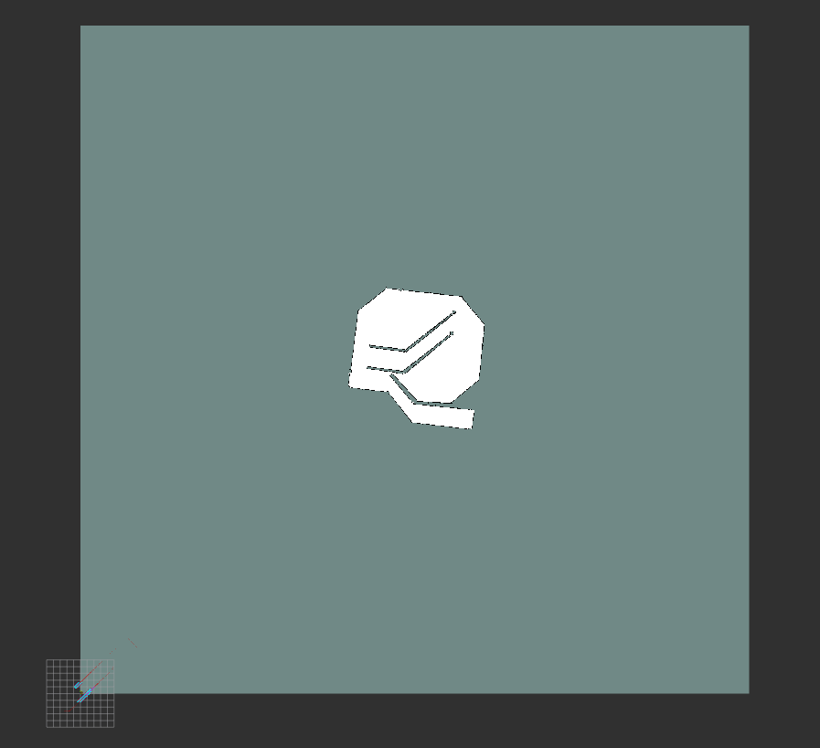

**Black** pixels are obstacles that the robot will inflate costmaps around

**Light grey** pixels are possible areas the robot can be found in (AMCL only distribute particles within these areas when initialising)

**Green** pixels are unknown areas (AMCL will not distribute particles here when you initialise)


### 2.4 Map Concepts <a name="2.4"></a>

[go to top](#top)

**Suppose we have a map:**


The navigation stack takes in map parameters using the .yaml files associated with each map image.

```yaml
image: <some_directory>
resolution: 0.050000 # Determines the scale of the map (meters per pixel)
origin: [0.000000, 0.000000, 0.000000] # Pose of lower-left corner map pixel
negate: 0
occupied_thresh: 0.65
free_thresh: 0.196
```

When you first view the map in RViz, press the "**Zero**" button on the top right hand corner to get a view like shown in the image above.

- The bottom left of the map is the map origin

  - Moving to the right moves you in the **positive x-axis**
  - Moving up moves you in the **positive y-axis**

- The robot's starting coordinate is always (0,0), no matter what the map origin is.

- The **map origin parameter** is as follows: [x, y, yaw]. It specifies the map's origin's coordinate.

  - In other words, if you specify a map origin [-10, -10, 0], the robot's starting position will actually move 10 units up and 10 units to the right on the map, as the map's origin position (the bottom left corner) is now (-10, -10) and the robot's starting position (0, 0).    

    Like so:

    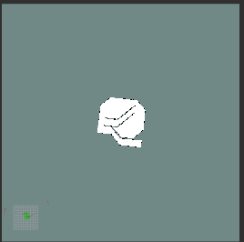

    Image: (-10, -10) map origin. The green mass of AMCL particles denotes the robot's starting position (0, 0).

  - Positive yaw rotates the local coordinate anti-clockwise (the global map shifts clockwise)

  - **WARNING**: You should **NOT** touch the yaw value, as the costmap and AMCL nodes don't take it into account, and so the costmaps won't actually move together with the maps. If you need to rotate the map origin somehow, change the map image instead.


### 2.5 Set Up the Static Transforms <a name="2.5"></a>

[go to top](#top)

You have to do this step **in addition** to whatever other static transforms your own robot setup requires (for example, laser frame static transforms.)

We need to define the transforms between the two new frames our beacons introduce (via the hedge_msg_adapter): **beacon_imu_link** (the frame for the beacon's IMU) and **beacon_map** (the frame for the beacon's map)!

We'll be using the [static_transform_publisher](http://wiki.ros.org/tf#static_transform_publisher) to do this!

Here's a refresher for the usage! The syntax using launch files is overloaded! It'll adjust accordingly!

```yaml
<launch>
  <node pkg="tf" type="static_transform_publisher" name="yaw_pitch_roll_broadcaster" args="x y z yaw pitch roll frame_id child_frame_id period_in_ms" />

  <node pkg="tf" type="static_transform_publisher" name="quarternion_broadcaster" args="x y z qx qy qz qw frame_id child_frame_id  period_in_ms" />
</launch>
```

We'll keep things simple and just set the corresponding frames to be the same as their respective parent frames! **Feel free to adjust this according to your needs!** But I recommend setting the map frame to be the same as the beacon_map frame to allow for the best practice I'll outline later on.

```yaml
<launch>
  <node pkg="tf" type="static_transform_publisher" name="beacon_imu_broadcaster" args="0 0 0 0 0 0 base_link beacon_imu_link 100" />

  <node pkg="tf" type="static_transform_publisher" name="beacon_map_broadcaster" args="0 0 0 0 0 0 map beacon_map 100" />
</launch>
```


### 2.6 Unite the Map and Beacon Coordinate Frames <a name="2.6"></a>

[go to top](#top)

It is **critical** to ensure that the coordinate frames of map and beacon_map are completely aligned (or as aligned as possible.) Otherwise, if they diverge, robot_localisation will get confused and fail catastrophically.

The procedure I'll outline below is what I consider to be the **best practice**, but I'll mention some other techniques you can do and you can come up with your own workflow.

Just remember again that the main goal is to have the **origins for the map and beacon map to be at the same x, y (and possibly z) coordinate, with the same orientation.** This will allow for any point within the beacon map to correspond to the appropriate point on the ROS map.

I'm going to assume you already know how to set up the beacon system for Marvelmind (if you don't please go read up on the corresponding tutorial.)

Here's a quick cheatsheet though:

**MAP COMMANDS**

- Click + Drag to pan map
- Scroll to zoom
- Click + Drag on compass to rotate map
- Click on compass, then scroll to rotate map
- Right click on compass to lock to one of the cardinal positions (align to 0, 90, 180, 270)
- Click on this button to flip the map 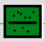

**SUBMAP COMMANDS**

- Click on the Submap button/label to enter the submap!
- Ctrl + Click + Drag on SUBMAP to translate beacons and correspondingly change their coordinates
- Ctrl + Scroll on SUBMAP to rotate beacons! and correspondingly change their coordinates (you might have to click)

Ok!


#### **Overview** (Checklist)

Here's the steps you need to complete in order to align your map and beacon map coordinate frames. Use this as a checklist!

- [ ] **Dashboard:** Create the beacon map
- [ ] **ROS:** Map your area with SLAM
- [ ] **ROS:** Get beacon coordinates using RViz
- [ ] **Image Editor:** Convert the SLAM map to a .png or .bmp
- [ ] **Dashboard:** Import the substrate (the map that was made with SLAM)
- [ ] **Dashboard:** Move the beacon submap so that at least **one** of the beacons matches the found beacon coordinates
- [ ] **Dashboard:** Click and drag on the beacons (flipping if needed), arranging them on the substrate as closely to the physical placement o fthe beacons as possible
- [ ] **Dashboard:** Rotate the submap to ensure that the compass north points up and the axes are as vertical or horizontal as possible. (You might need to use the fine tuning settings on the bottom right hand side of the dashboard window.)
- [ ] **Dashboard:** Verify the X, Y coordinates of the beacons with your recorded values.


#### **Starting From The Beginning**

It'll probably be best to show you what we're aiming for at first so it puts every step in perspective.

This is the map I'll be using. I made it using SLAM in ROS. The map origin is at (-50, -50), so **the (0, 0) coordinate is at the centre of the map.**

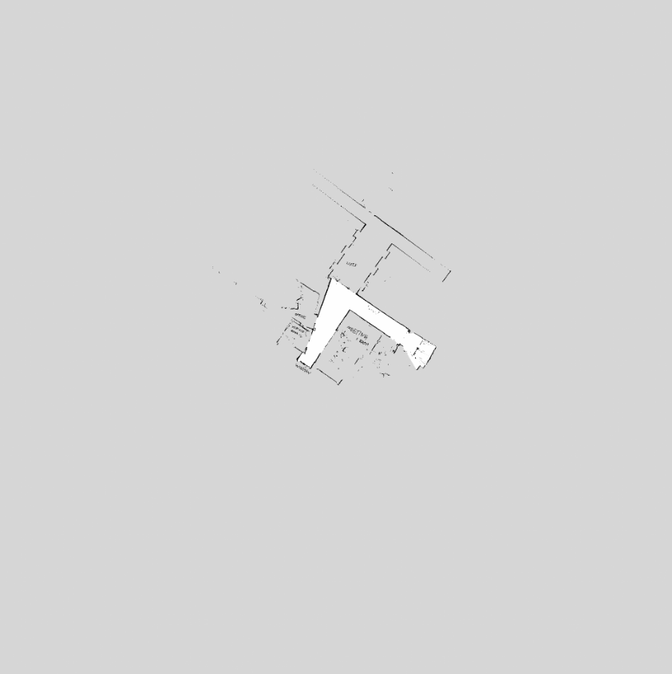

​    
We want to end up with a map that looks like this, with the beacon origins corresponding to the map origin, and with the orientation of the origins being the same (in this case, the y axis and x axis being on the vertical and horizontal respectively.)


(The goal! Look at the nice **straight** axes!)

​    
In so doing, if we were to publish the coordinates of the points where the beacons are supposed to be using RViz, **those points should line up with the reported coordinates of the beacons on the Marvelmind dashboard, or should be very close.**


#### **Submaps**

Ok! So let's say we have beacons set up already and they've found their relative positions.

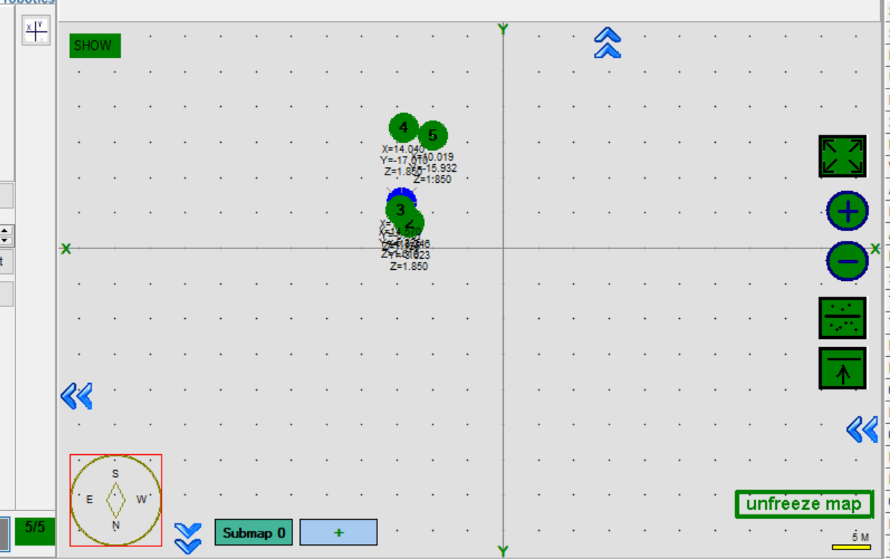

​    
Notice that the submap button is selected! So we're in submap mode!


​    
This allows us to do cool things! Like...

- Ctrl+Click+Drag to move translate beacon origin (and hence all the beacons) 

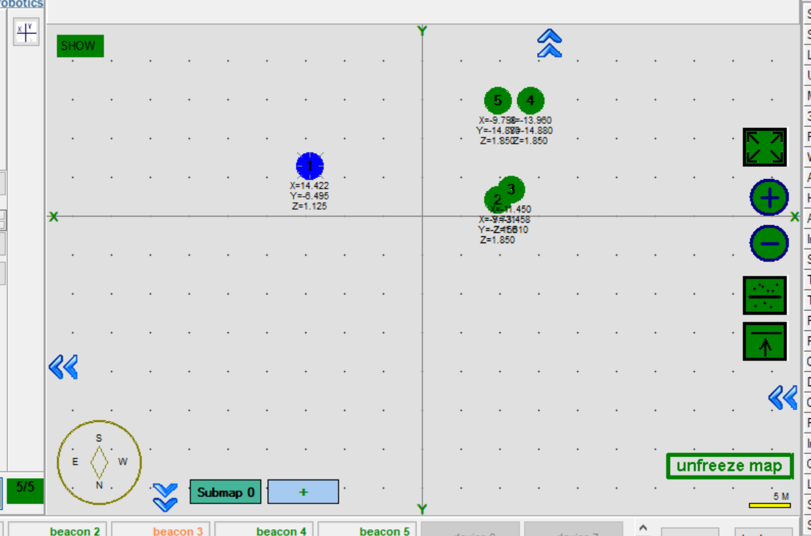

(The beacons translated to the right!)


- Ctrl+Scroll to rotate the beacons around one of the other ones! (In this case they've rotated around beacon 4, about 90 degrees anti-clockwise.)

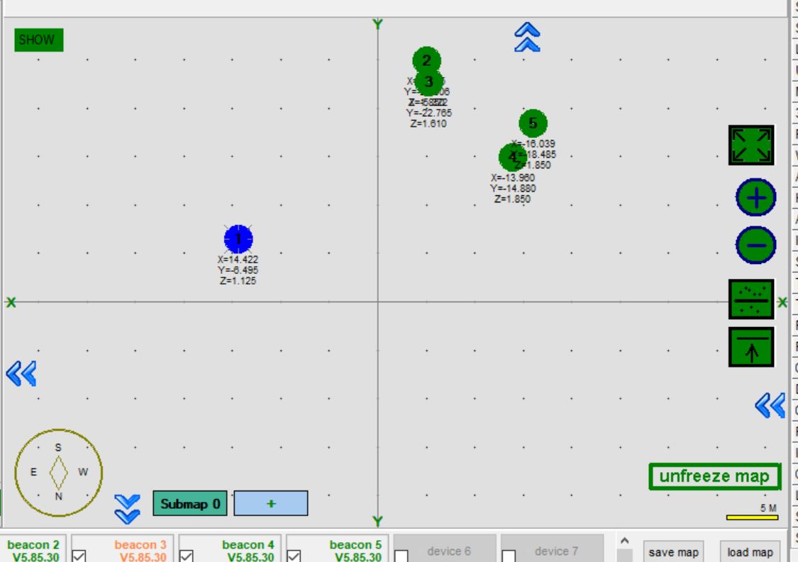

(The beacons rotated!)


You can also fine-tune the settings using the options on the right! (Just select the modem first and make sure you're in submap mode.)    


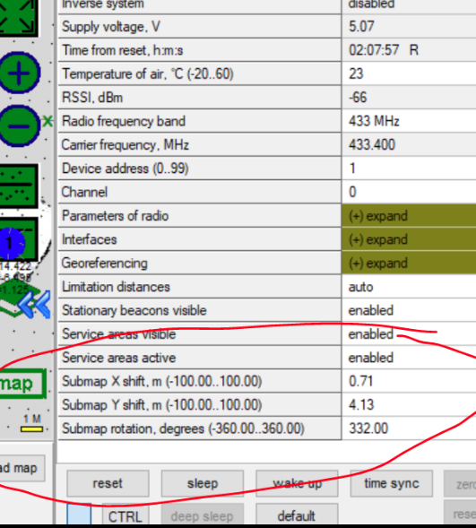


> Notice that this is different from shifting the camera! The beacons actually change relative to the origin!


#### **Substrates**

With the **powerful** tool of submaps, we can then unlock the **true potential** of map substrates!

Substrates are just imported image files into Marvelmind's dashboard, and are used to set the zoom and rotation of the beacons automatically (with some intuitive user input.)

Load the substrate!   

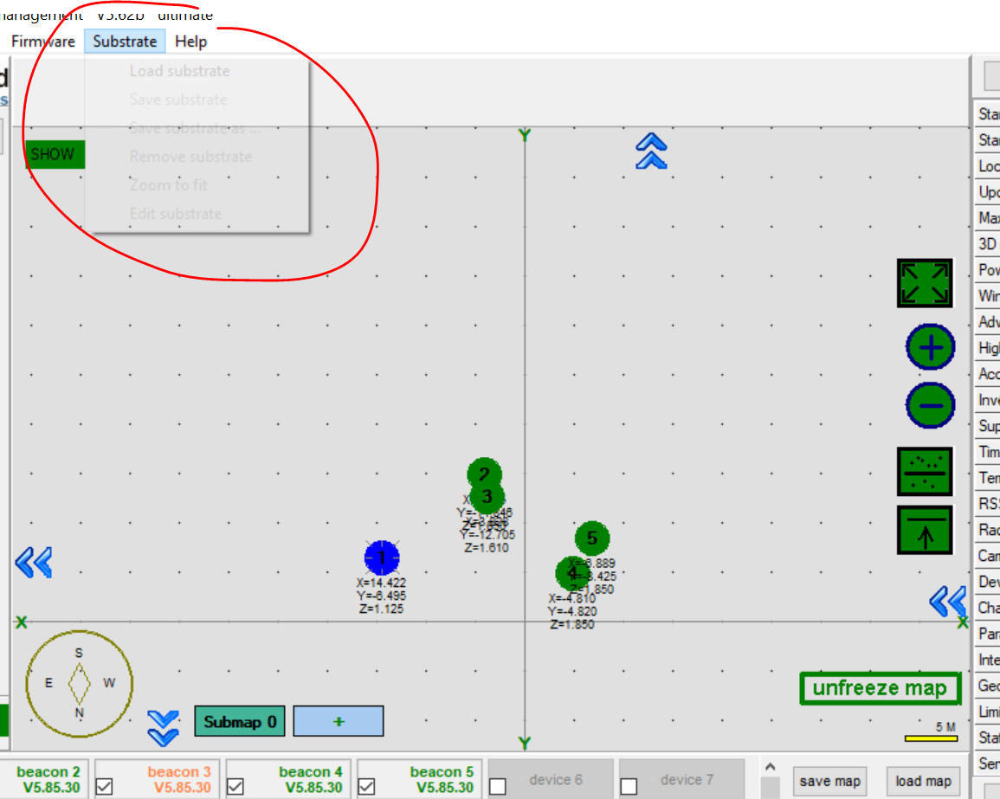


Select a map image! (Convert the .pgm image file you got from SLAM into a suitable image type like png or bmp first)

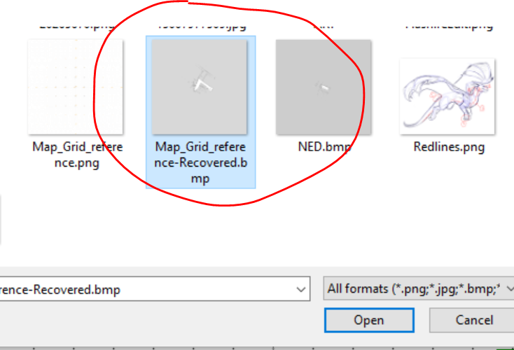


Here, I've selected Map_Grid_reference-Recovered.bmp as my substrate. It has **such** a wonderfully descriptive name!

But anyway, once you've loaded it, it should reflect in the dashboard, and will most likely be **horribly misaligned.** This is fine!

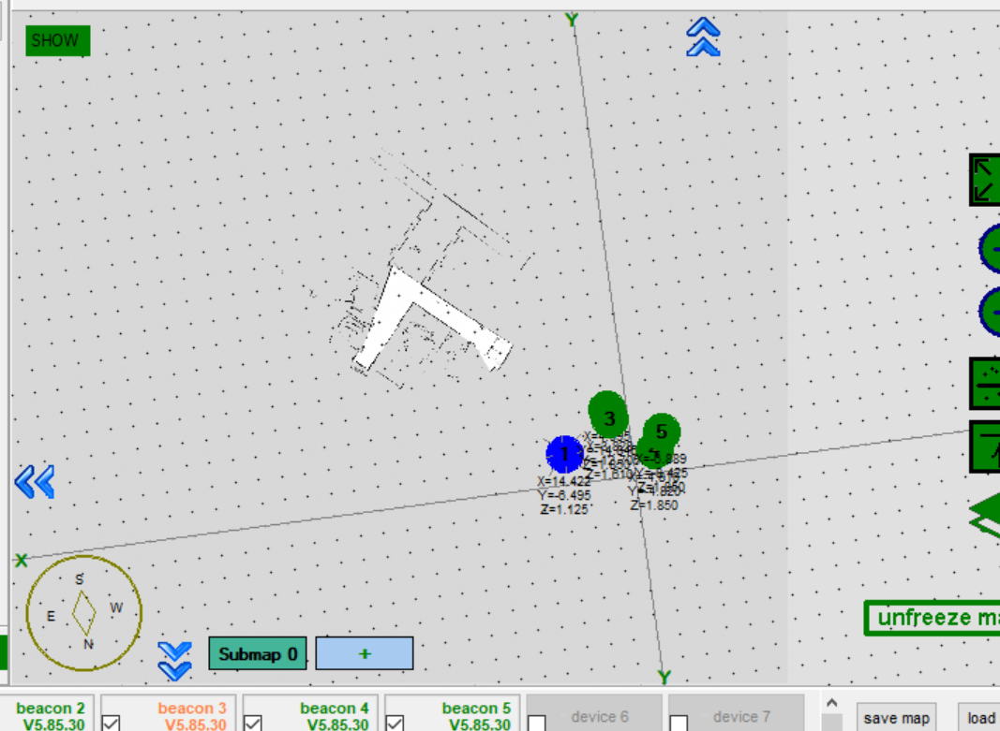


#### **Getting Your Beacon Coordinates**

Open up RViz and load your map! You should already know how to do this, if you don't go look up the [Linorobot Tutorial](https://linorobot.org)

You may also choose to zero the map to make sure that it's properly oriented.

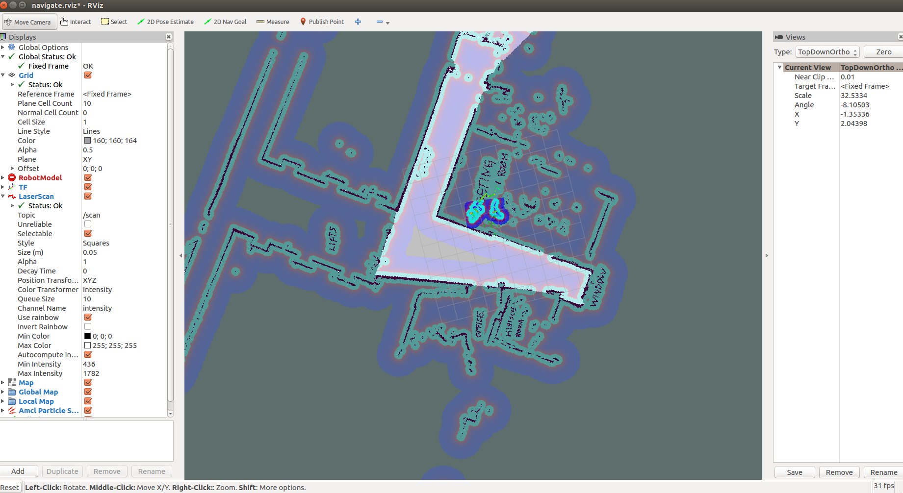

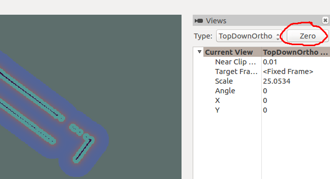


Then go ahead and click **Publish Point**

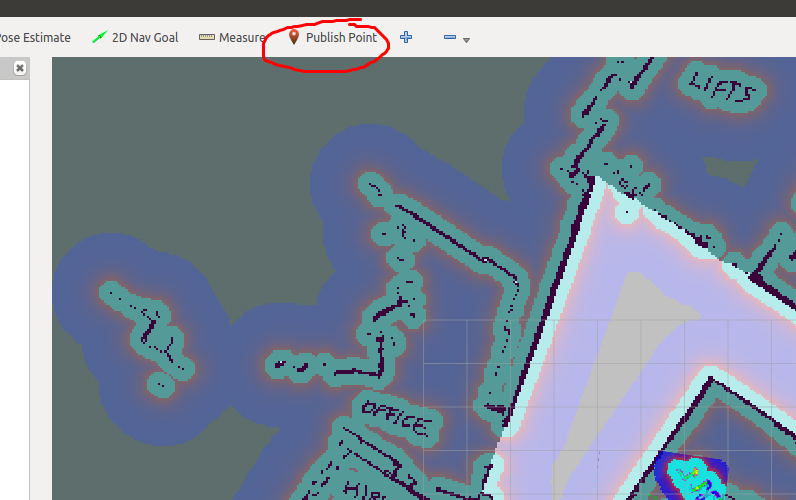


When you mouse over the map in this state, you'll get X and Y coordinates on the bottom left of your screen. (X, Y, Z)

**Record the corresponding coordinates for your beacons!** You need at least one, but having all of them makes things a lot easier for you when it comes to validating your beacon coordinates.

If you want to go faster, you may decide to subscribe to the topic that RViz publishes to.

```bash
$ rostopic echo /clicked_point
```

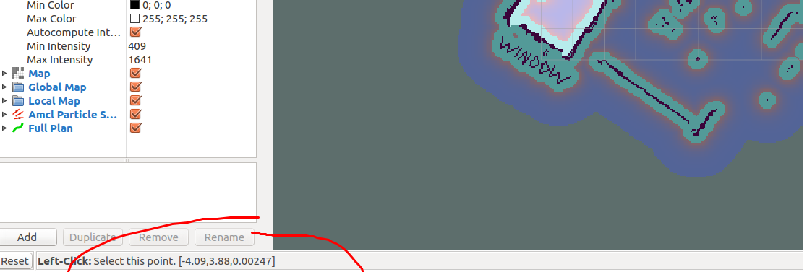

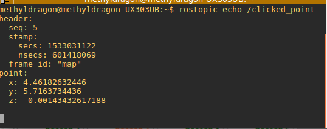


> **Warning:**
>
> Your beacon coordinates should NOT be close to (0, 0)! Make sure they're at least a meter away if possible, because otherwise you might have issues fitting the beacons to the substrate in the next step. It's a bug in the Dashboard, not a fault of ROS.


#### **Aligning the Beacons to the Substrate**

Ok! Let's just suppose beacon 5 is on (0.011, 0.031) for some reason. (I know I said in the warning that this is a **bad practice**, but let's just roll with it for demonstration purposes.)

Feel free to zoom it, but move the submap such that beacon 5's coordinates **matches** with that measured value!

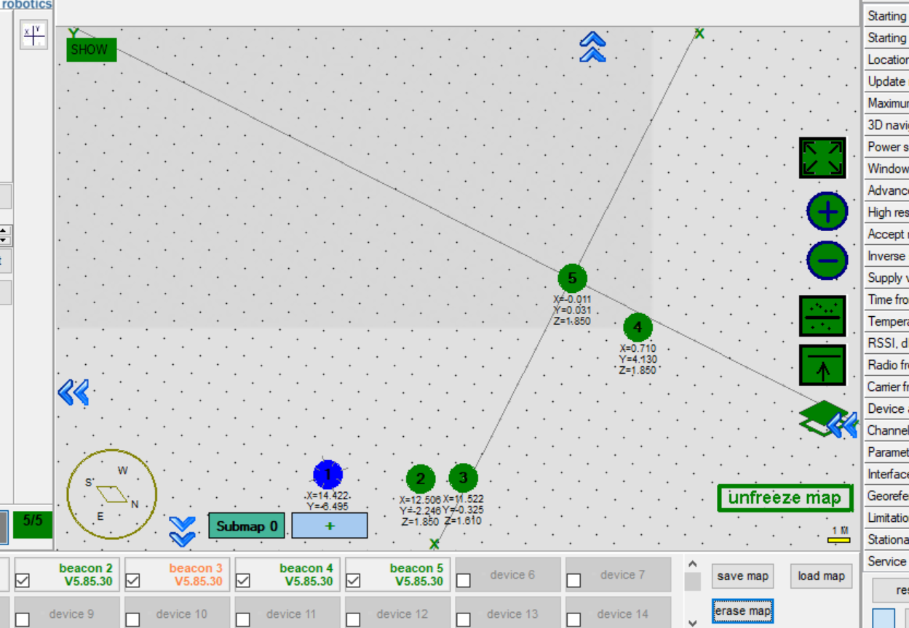


Then, **click and drag** the beacons and move them onto the substrate! 

You should find that the positions of the beacons will adjust accordingly as you manually shift the positions of the beacons one by one to their correct positions. (Fine tune them as much as you can!) 

The relative positions of the beacons shouldn't change though!

> **Note:** You might have to zoom in and out a little to get the substrate and map to update.

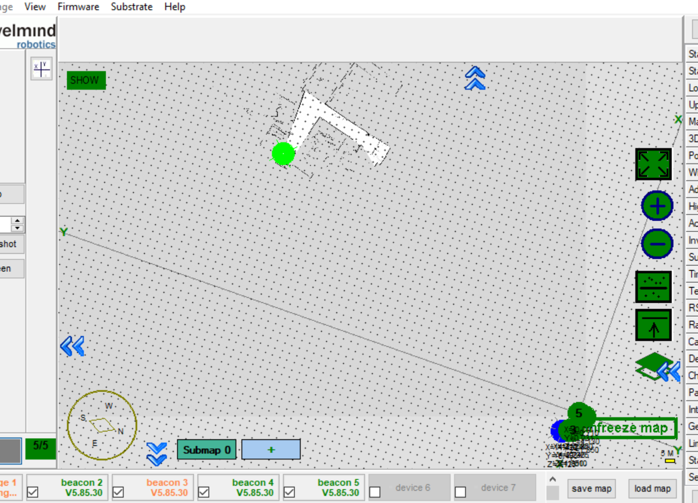


What you should find is that even though the configuration of the beacons have changed with respect to the substrate, their positions relative to each other and the beacon origin **have not changed!**

Beacon 5 is STILL on (0.011, 0.031). Actually, ALL the beacons are still on their original coordinate!

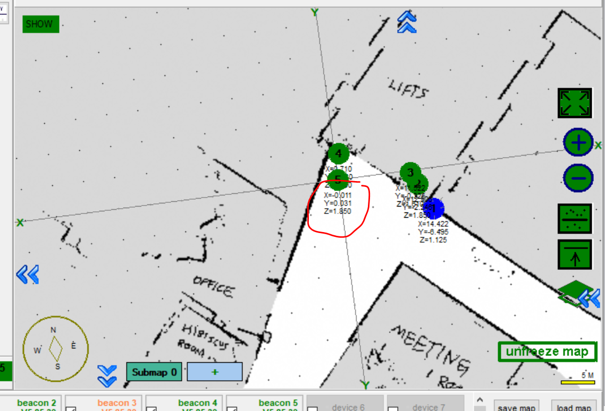


>  **Note:** If you are having problems with the above few steps and cannot get a good fit, you might have to click the flip button to flip the beacon map.

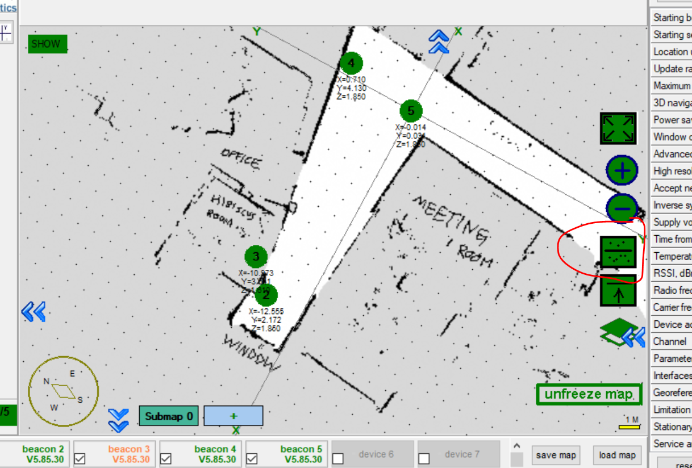


Eventually you should end up with something like this. **But we're not done yet!**

We need to make sure that the origin of the beacon map and the origin of the map is **orientated the same way!** Otherwise you'll have issues with yaw and all your coordinates will go off!

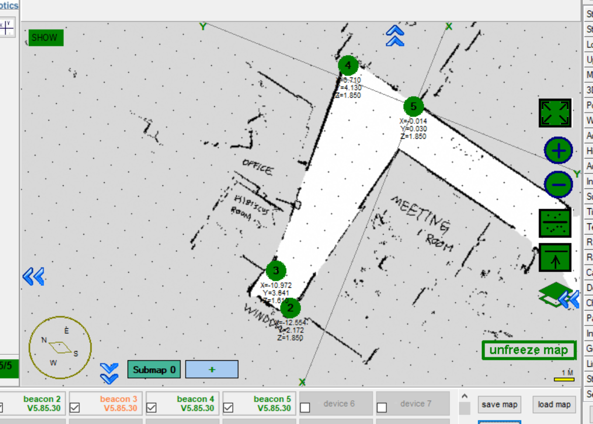


Just rotate the submap and aim to get the north of the compass to point up and for the map axes to be as aligned as possible to the vertical and horizontal!

Eventually you **will need to fine tune the submap rotation parameter, since the scroll rotation method is very coarse.**

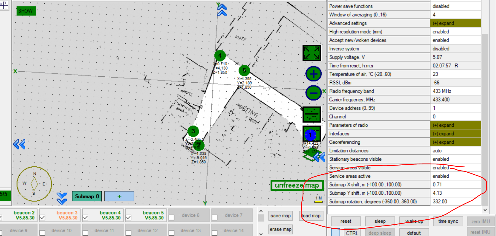


But keep at it, and you'll be done in no time! CH3EERS!

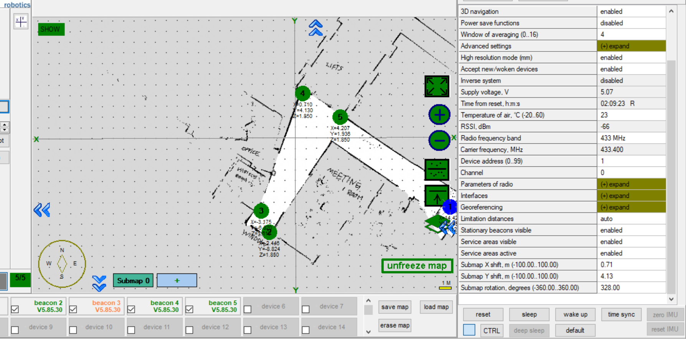


Then just compare and verify the beacon coordinates with your recorded points, and **make sure that they're as aligned as possible**! If not, make the necessary adjustments.


#### **SAVE THE MAP**

Please remember to **save the map** and **write it to the modem!** I found that the modem sometimes forgets the map (usually when one of the beacons loses power or stops communicating with the modem momentarily.) **You can listen out for this** by listening to the beacons! If the hedgehog stops clicking and the stationary beacons start clicking iteratively in order, then you know that the map got forgotten.

This is when you open up the dashboard in windows, and load the map again, and make sure that the modem remembers it (unplugging the modem and reconnecting it to see if it actually finally remembers.)

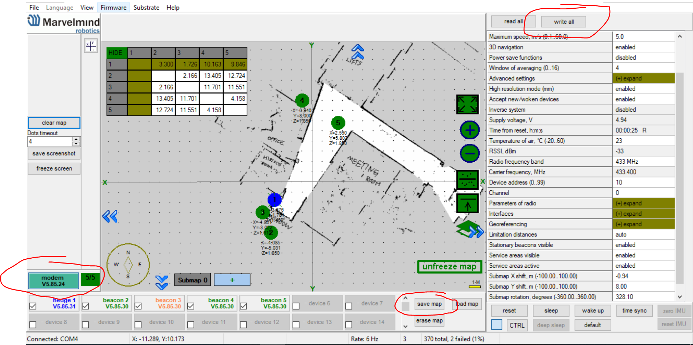


#### **BONUS: Additional Strategies**

If for some strange reason you don't want to use the substrate method... you can throw the following techniques into your routine.


**Define a new origin:**

**Align two beacons** against a wall, and use them as a straight reference point. Then, click the x, y button on the top left, and click **three beacons.**

This will define a new origin. The first beacon that is clicked becomes centered at (0, 0), whereas the second and third define the axes.

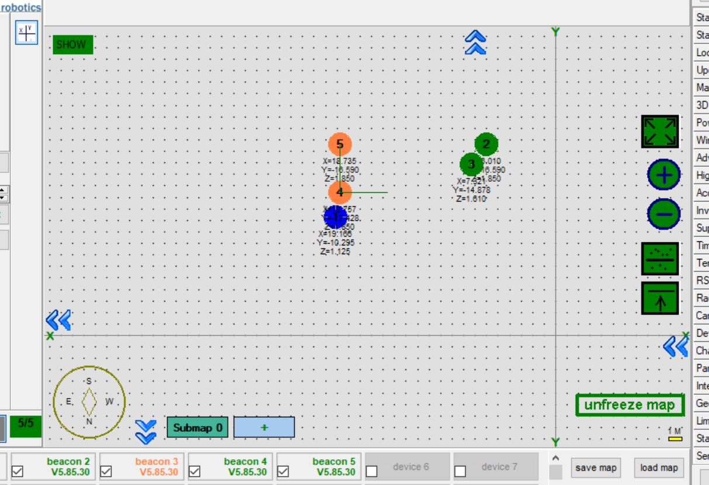

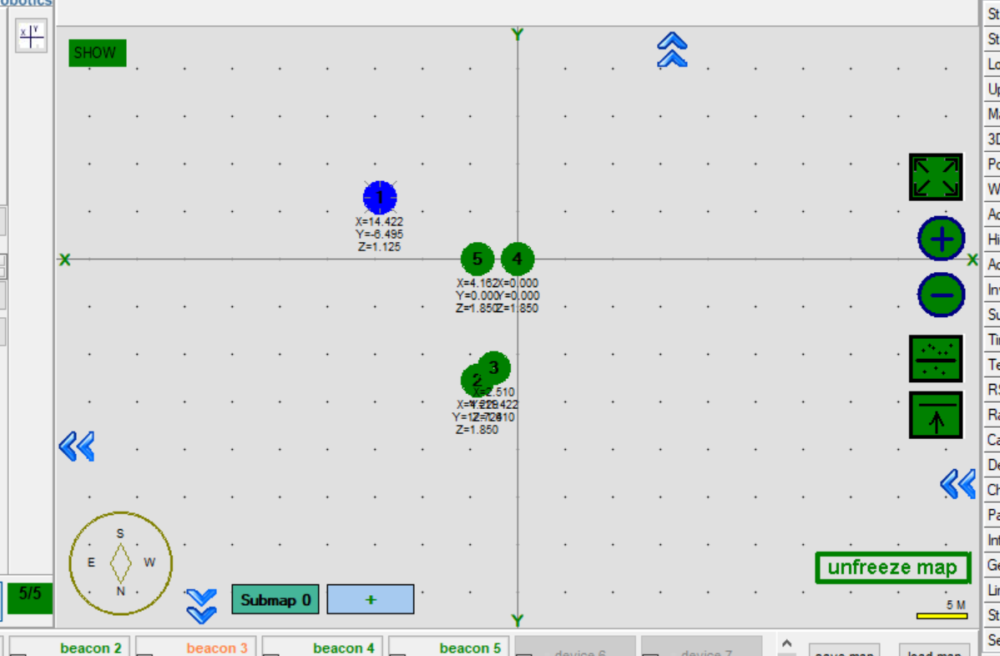

(4, 5, 3 were clicked in order.)


**Manually edit the map image:**

Just edit it. I recommend it in photoshop!

Make sure that you select **nearest neighbour** for the interpolation when you transform the map. You do not want wonky blurring effects in your map!

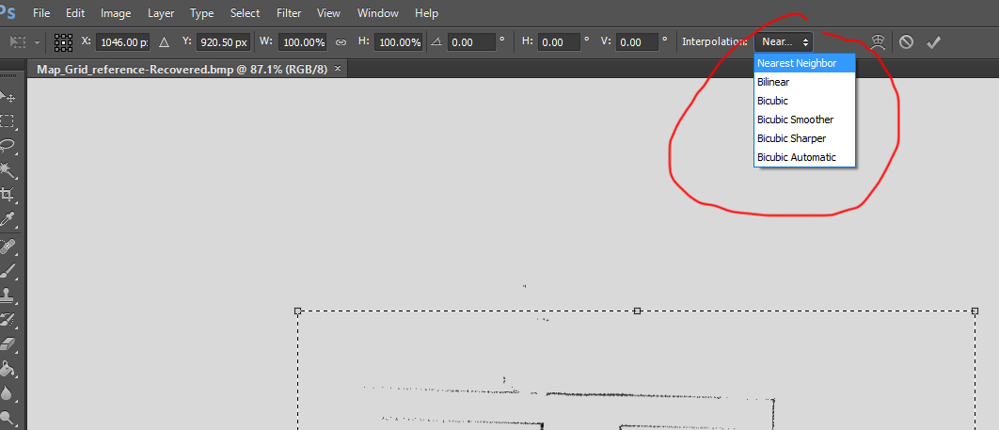


**Define a static transform:**

Remember this? Change x, y, z, and yaw to fit your purposes.

```yaml
  <node pkg="tf" type="static_transform_publisher" name="beacon_map_broadcaster" args="x y z yaw pitch roll map beacon_map 100" />
```


### **2.7 Configure AMCL <a name="2.7"></a>**

[go to top](#top)

**Turn off the AMCL transform publishing** and feel free to **configure the robot initial pose.**

You change the following parameters:

**Transform publishing**

- tf_broadcast

**Initial pose**

The pose is defined relative to the map after adjustments with the origin! (Think /clicked_point)

- initial_pose_x (in meters)
- initial_pose_y (in meters)
- initial_pose_a (yaw in radians)

You can do this by either appending to the AMCL launch file

```yaml
<param name="initial_pose_x" value="0.0"/>
<param name="initial_pose_y" value="0.0"/>
<param name="initial_pose_a" value="0.0"/>

<param name="tf_broadcast" value="false"/>
```

Or by loading in parameters

```yaml
<rosparam command="load" file="$(find package_name)/param_file_name.yaml" />
```

Where param_file_name.yaml

```yaml
initial_pose_x: <some position in meters>
initial_pose_y: <some position in meters>
initial_pose_a: <some yaw in radians>

tf_broadcast: false
```

If you have an odometry EKF node, also remember to remap the inputs to the AMCL node

```yaml
<remap from="odom" to="odometry/filtered" />
```


### 2.8 Configure robot_localization <a name="2.8"></a>

[go to top](#top)

Then all we really need to do is configure robot_localization!

Ensure that the mobile beacon is plugged into the computer, and you've enabled permissions for the ttyACM port that it's meant to connect to, and all the relevant nodes are running.

- We know that the mobile beacon (according to my message adapter), publishes its position relative to the beacon map on /hedge_pose as a [geometry_msgs/PoseWithCovarianceStamped](http://docs.ros.org/api/geometry_msgs/html/msg/PoseWithCovarianceStamped.html) message.
- AMCL publishes the pose estimate it has on /amcl_pose as a [geometry_msgs/PoseWithCovarianceStamped](http://docs.ros.org/api/geometry_msgs/html/msg/PoseWithCovarianceStamped.html) message as well.

They're both global pose estimates that should affect the map -> odom transform! So if we remember the previous part of the sensor fusion tutorial, it should be quite easy to configure!

**I want to fuse the x, y pose data as my hedgehogs did not give me orientation data.**


#### **Configure your bringup launch file**

I'm going to add a single ekf_localization_node in this example. I will not be fusing the odometry sources with an odom frame EKF node. But remember that even a map frame EKF node requires all odom sources to be input into it.

> This is why you'll find that there is no remapping of odom/filtered to odom, since odom/filtered is not published by a map frame EKF node!

I'll be assuming we're using the linorobot stack here! Make a robot_localization.yaml files in there to settle your configurations! We have one for odometry and one for global pose estimates.

We'll call them **robot_localization_odom** and **robot_localization_map** respectively

```yaml
    <!-- Odom-IMU Extended Kalman Filter-->
    <node pkg="robot_localization" type="ekf_localization_node" name="ekf_localization_odom" clear_params="true"> 
        <rosparam command="load" file="$(find linorobot_ekf)/param/ekf/robot_localization_odom.yaml" />
    </node>

    <!-- AMCL and Beacon Extended Kalman Filter-->
    <node pkg="robot_localization" type="ekf_localization_node" name="ekf_localization_map" clear_params="true"> 
        <rosparam command="load" file="$(find linorobot_ekf)/param/ekf/robot_localization_map.yaml" />
    </node>
```


**Configure the .yaml file**

> Helpful reminder:
>
> ```
> [x_pos   , y_pos    , z_pos,
>  roll    , pitch    , yaw,
>  x_vel   , y_vel    , z_vel,
>  roll_vel, pitch_vel, yaw_vel,
>  x_accel , y_accel  , z_accel]
> ```

Also note: I left out the imu fusion here because I'm not using it. But if you want to, then include an imu0 for the hedge_imu topic, and configure it accordingly.

I've also tuned the initial_estimate_covariance and process_noise_covariance. The matrices are **not the default matrices!**

**robot_localization_map.yaml**

```yaml
frequency: 10
two_d_mode: true

map_frame: map
odom_frame: odom
base_link_frame: base_link
world_frame: map

transform_time_offset: 0.1

smooth_lagged_data: true
dynamic_process_noise_covariance: false

odom0: /odom
odom0_config: [false, false, false,
               false, false, false,
               true, true, false,
               false, false, true,
               false, false, false]
               
odom0_differential: true

imu0: /imu/data
imu0_config: [false, false, false,
              false, false, true,
              false, false, false,
              false, false, true,
              false, false, false]

imu0_differential: true
imu0_relative: true 

pose0: hedge_pose # Hedgehog!
pose0_config: [true,  true,  false,
               false, false, false,
               false, false, false,
               false, false, false,
               false, false, false]

pose0_rejection_threshold: 3

# Since AMCL is more likely to fail than the beacons, you might want to treat the beacons
# as a primary source, and set pose1_differential: true
# In that case, set x', y' and yaw' to true, and the rest to false!

pose1: amcl_pose # AMCL!
pose1_config: [true,  true, false,
               false, false, true,
               false, false, false,
               false, false, false,
               false, false, false]

pose1_rejection_threshold: 2

# poseN_rejection_threshold: (YOU MIGHT WANT THIS. If it's above the stated threshold value, the EKF will ignore the reading) (Defaults to numeric_limits<double>::max())

# [ADVANCED] The process noise covariance matrix can be difficult to tune, and can vary for each application, so it is exposed as a configuration parameter. This matrix represents the noise we add to the total error after each prediction step. 

# The better the omnidirectional motion model matches your system, the smaller these values can be. However, if users find that a given variable is slow to converge, one approach is to increase the process_noise_covariance diagonal value for the variable in question, which will cause the filter's predicted error to be larger, which will cause the filter to trust the incoming measurement more during correction. 

# The values are ordered as x, y, z, roll, pitch, yaw, vx, vy, vz, vroll, vpitch, vyaw, ax, ay, az. 
# Defaults to the matrix below if unspecified.

process_noise_covariance: [0.05, 0,    0,    0,    0,    0,    0,     0,     0,    0,    0,    0,    0,    0,    0,
                           0,    0.05, 0,    0,    0,    0,    0,     0,     0,    0,    0,    0,    0,    0,    0,
                           0,    0,    0.06, 0,    0,    0,    0,     0,     0,    0,    0,    0,    0,    0,    0,
                           0,    0,    0,    0.03, 0,    0,    0,     0,     0,    0,    0,    0,    0,    0,    0,
                           0,    0,    0,    0,    0.03, 0,    0,     0,     0,    0,    0,    0,    0,    0,    0,
                           0,    0,    0,    0,    0,    0.06, 0,     0,     0,    0,    0,    0,    0,    0,    0,
                           0,    0,    0,    0,    0,    0,    0.025, 0,     0,    0,    0,    0,    0,    0,    0,
                           0,    0,    0,    0,    0,    0,    0,     0.025, 0,    0,    0,    0,    0,    0,    0,
                           0,    0,    0,    0,    0,    0,    0,     0,     0.04, 0,    0,    0,    0,    0,    0,
                           0,    0,    0,    0,    0,    0,    0,     0,     0,    0.01, 0,    0,    0,    0,    0,
                           0,    0,    0,    0,    0,    0,    0,     0,     0,    0,    0.01, 0,    0,    0,    0,
                           0,    0,    0,    0,    0,    0,    0,     0,     0,    0,    0,    0.02, 0,    0,    0,
                           0,    0,    0,    0,    0,    0,    0,     0,     0,    0,    0,    0,    0.01, 0,    0,
                           0,    0,    0,    0,    0,    0,    0,     0,     0,    0,    0,    0,    0,    0.01, 0,
                           0,    0,    0,    0,    0,    0,    0,     0,     0,    0,    0,    0,    0,    0,    0.015]

# [ADVANCED] This represents the initial value for the state estimate error covariance matrix. Setting a diagonal value (variance) to a large value will result in rapid convergence for initial measurements of the variable in question. Users should take care not to use large values for variables that will not be measured directly. 

# The values are ordered as x, y, z, roll, pitch, yaw, vx, vy, vz, vroll, vpitch, vyaw, ax, ay, az.
# Defaults to the matrix below if unspecified.

initial_estimate_covariance: [1e-4, 0,    0,    0,    0,    0,    0,    0,    0,    0,     0,     0,     0,    0,    0,
                              0,    1e-4, 0,    0,    0,    0,    0,    0,    0,    0,     0,     0,     0,    0,    0,
                              0,    0,    1e-9, 0,    0,    0,    0,    0,    0,    0,     0,     0,     0,    0,    0,
                              0,    0,    0,    1e-9, 0,    0,    0,    0,    0,    0,     0,     0,     0,    0,    0,
                              0,    0,    0,    0,    1e-9, 0,    0,    0,    0,    0,     0,     0,     0,    0,    0,
                              0,    0,    0,    0,    0,    1e-6, 0,    0,    0,    0,     0,     0,     0,    0,    0,
                              0,    0,    0,    0,    0,    0,    1e-9, 0,    0,    0,     0,     0,     0,    0,    0,
                              0,    0,    0,    0,    0,    0,    0,    1e-9, 0,    0,     0,     0,     0,    0,    0,
                              0,    0,    0,    0,    0,    0,    0,    0,    1e-9, 0,     0,     0,     0,    0,    0,
                              0,    0,    0,    0,    0,    0,    0,    0,    0,    1e-9,  0,     0,     0,    0,    0,
                              0,    0,    0,    0,    0,    0,    0,    0,    0,    0,     1e-9,  0,     0,    0,    0,
                              0,    0,    0,    0,    0,    0,    0,    0,    0,    0,     0,     1e-9,  0,    0,    0,
                              0,    0,    0,    0,    0,    0,    0,    0,    0,    0,     0,     0,     1e-9, 0,    0,
                              0,    0,    0,    0,    0,    0,    0,    0,    0,    0,     0,     0,     0,    1e-9, 0,
                              0,    0,    0,    0,    0,    0,    0,    0,    0,    0,     0,     0,     0,    0,    1e-9]
```

**robot_localization_odom.yaml**

```yaml
frequency: 10

two_d_mode: true

odom0: /odom
odom0_config: [false, false, false,
               false, false, false,
               true, true, false,
               false, false, true,
               false, false, false]
               
odom0_differential: true

imu0: /imu/data
imu0_config: [false, false, false,
              false, false, true,
              false, false, false,
              false, false, true,
              false, false, false]

imu0_differential: true
imu0_relative: true

odom_frame: odom
base_link_frame: base_footprint
world_frame: odom
publish_tf: true

process_noise_covariance: [0.05, 0,    0,    0,    0,    0,    0,     0,     0,    0,    0,    0,    0,    0,    0,
                           0,    0.05, 0,    0,    0,    0,    0,     0,     0,    0,    0,    0,    0,    0,    0,
                           0,    0,    0.06, 0,    0,    0,    0,     0,     0,    0,    0,    0,    0,    0,    0,
                           0,    0,    0,    0.03, 0,    0,    0,     0,     0,    0,    0,    0,    0,    0,    0,
                           0,    0,    0,    0,    0.03, 0,    0,     0,     0,    0,    0,    0,    0,    0,    0,
                           0,    0,    0,    0,    0,    0.06, 0,     0,     0,    0,    0,    0,    0,    0,    0,
                           0,    0,    0,    0,    0,    0,    0.025, 0,     0,    0,    0,    0,    0,    0,    0,
                           0,    0,    0,    0,    0,    0,    0,     0.025, 0,    0,    0,    0,    0,    0,    0,
                           0,    0,    0,    0,    0,    0,    0,     0,     0.04, 0,    0,    0,    0,    0,    0,
                           0,    0,    0,    0,    0,    0,    0,     0,     0,    0.01, 0,    0,    0,    0,    0,
                           0,    0,    0,    0,    0,    0,    0,     0,     0,    0,    0.01, 0,    0,    0,    0,
                           0,    0,    0,    0,    0,    0,    0,     0,     0,    0,    0,    0.02, 0,    0,    0,
                           0,    0,    0,    0,    0,    0,    0,     0,     0,    0,    0,    0,    0.01, 0,    0,
                           0,    0,    0,    0,    0,    0,    0,     0,     0,    0,    0,    0,    0,    0.01, 0,
                           0,    0,    0,    0,    0,    0,    0,     0,     0,    0,    0,    0,    0,    0,    0.015]

initial_estimate_covariance: [1e-9, 0,    0,    0,    0,    0,    0,    0,    0,    0,     0,     0,     0,    0,    0,
                              0,    1e-9, 0,    0,    0,    0,    0,    0,    0,    0,     0,     0,     0,    0,    0,
                              0,    0,    1e-9, 0,    0,    0,    0,    0,    0,    0,     0,     0,     0,    0,    0,
                              0,    0,    0,    1e-9, 0,    0,    0,    0,    0,    0,     0,     0,     0,    0,    0,
                              0,    0,    0,    0,    1e-9, 0,    0,    0,    0,    0,     0,     0,     0,    0,    0,
                              0,    0,    0,    0,    0,    1e-9, 0,    0,    0,    0,     0,     0,     0,    0,    0,
                              0,    0,    0,    0,    0,    0,    1e-9, 0,    0,    0,     0,     0,     0,    0,    0,
                              0,    0,    0,    0,    0,    0,    0,    1e-9, 0,    0,     0,     0,     0,    0,    0,
                              0,    0,    0,    0,    0,    0,    0,    0,    1e-9, 0,     0,     0,     0,    0,    0,
                              0,    0,    0,    0,    0,    0,    0,    0,    0,    1e-9,  0,     0,     0,    0,    0,
                              0,    0,    0,    0,    0,    0,    0,    0,    0,    0,     1e-9,  0,     0,    0,    0,
                              0,    0,    0,    0,    0,    0,    0,    0,    0,    0,     0,     1e-9,  0,    0,    0,
                              0,    0,    0,    0,    0,    0,    0,    0,    0,    0,     0,     0,     1e-9, 0,    0,
                              0,    0,    0,    0,    0,    0,    0,    0,    0,    0,     0,     0,     0,    1e-9, 0,
                              0,    0,    0,    0,    0,    0,    0,    0,    0,    0,     0,     0,     0,    0,    1e-9]
```


### 2.9 Tune the Covariances <a name="2.9"></a>

[go to top](#top)

You'll then wonder how you might configure the covariances for the beacon source? (AMCL should settle it on its own.)

Easy! We'll just set up a static one that we'll tune.

Head over to the hedge_msg_adapter package, and go into the param folder. You should find a covariances.yaml file. **I wrote that message adapter and exposed the covariances as parameters you can easily load using config files** (via rosparam.)

If you read the previous part of the tutorial, this should be pretty self explanatory. To keep things simple, we'll just tune the diagonals.

But specifically for us with the use of the beacons, just adjust the pose_covariance parameter accordingly, and remember to roslaunch the adapter so the parameters will be loaded in! (Remember, lower covariance means higher confidence!)

I put in some starter values for the pose covariance based off of the Marvelmind beacon reported +-2cm resolution. Since it's a covariance, it means that the diagonals are actually the variances! Which is the standard deviation squared. So... 0.02 ^ 2 = 0.0004

```yaml
# roll, pitch, yaw
# float[9]
imu_orientation_covariance: [0, 0, 0,
                             0, 0, 0,
                             0, 0, 0]

# roll, pitch, yaw
# float[9]
imu_angular_velocity_covariance: [0, 0, 0,
                                  0, 0, 0,
                                  0, 0, 0]

# x, y, z
# float[9]
imu_linear_acceleration_covariance: [0, 0, 0,
                                     0, 0, 0,
                                     0, 0, 0]

# x, y, z, roll, pitch, yaw
# float[36]
pose_covariance: [0.0004, 0, 0, 0, 0, 0,
                  0, 0.0004, 0, 0, 0, 0,
                  0, 0, 0.0004, 0, 0, 0,
                  0, 0, 0, 0.0004, 0, 0,
                  0, 0, 0, 0, 0.0004, 0,
                  0, 0, 0, 0, 0, 0.0004]
```

But **here's a tuned one that worked better for me!**

```yaml
# roll, pitch, yaw
# float[9]
imu_orientation_covariance: [0, 0, 0,
                             0, 0, 0,
                             0, 0, 0]

# roll, pitch, yaw
# float[9]
imu_angular_velocity_covariance: [0, 0, 0,
                                  0, 0, 0,
                                  0, 0, 0]

# x, y, z
# float[9]
imu_linear_acceleration_covariance: [0, 0, 0,
                                     0, 0, 0,
                                     0, 0, 0]

# x, y, z, roll, pitch, yaw
# float[36]
pose_covariance: [0.1404, 0, 0, 0, 0, 0,
                  0, 0.1404, 0, 0, 0, 0,
                  0, 0, 0.1404, 0, 0, 0,
                  0, 0, 0, 0.0004, 0, 0,
                  0, 0, 0, 0, 0.0004, 0,
                  0, 0, 0, 0, 0, 0.0004]
```

> The reason the numbers are so weird, is because I realised that the EKF biases the final estimate towards some balance of the **most recent** and **smallest covariance** reading.
>
> As the beacons publish their pose more often than AMCL predicts the pose, you'll find that the beacon pose is factored in more often, so there's a greater bias that I have to offset with setting a static covariance of the beacon.
>
> Still though, it would have been nice to have a dynamic covariance for the beacons, make sure to implement it if you have a sensor source that can do so, but as is illustrated here, it's not super necessary, just nice to have.

Do note that I used the rosbag approach to ensure consistency of data, and adjusted the covariances by feel. (If a particular axis of a sensor is giving more drift, or the Kalman Filter seems to be favouring a particular source too much for that axis, it's a good rule of thumb to bump up the covariance a little bit.)

There are other ways of tuning this of course, do check the tuning section of the first part of this tutorial for more details.


### 2.10 Validate the Sensor Fusion <a name="2.10"></a>

[go to top](#top)

Start off with making either two packages or two workspaces so you can easily compare between the EKF and no-EKF setups.

If you ask me, the easiest way to validate the sensor fusion is to purposely cause your AMCL node to give you bad data. This is easy! Just decrease the min/max particles on the AMCL node to a ridiculous number like 10. (It's normally something like 500 to 10,000.)

Then drive the robot around like crazy (after giving it a sensible initial pose) and see the performance.

Once you get to a good place, bump the AMCL up again, and do tests to compare between the EKF and no EKF.

If it works really well, then congratulations! We're good to build **more marvelous things!**

#### **Overview** (Checklist)

- [ ] Use indoor_gps_ws as a reference
- [ ] Setup linorobot stack accordingly
- [ ] Setup the beacons accordingly (according to the previous few parts of this tutorial)
- [ ] Set permissions for connected ttyACM* port for beacon (`$ sudo chmod -R 777 /dev/ttyACM<NUMBER>`)
- [ ] Configure AMCL to be bad (lower min and max particles to 10 or lower)
- [ ] Run the following on the robot:
  - [ ] `$ rosrun marvelmind_nav hedge_rcv_bin <YOUR DEVICE DIRECTORY>`
  - [ ] `$ rosrun hedge_msg_adapter hedge_msg_adapter`
  - [ ] `$ roslaunch linorobot_ekf bringup.launch`
  - [ ] `$ roslaunch linorobot_ekf navigate_ekf.launch`
- [ ] Run the following on your computer
  - [ ] (After navigating to your linorobot/rviz directory) `$ rviz -d navigate.rviz`
  - [ ] `$ rosrun teleop_twist_keyboard teleop_twist_keyboard`
- [ ] Drive the robot around and see how well the EKF works without AMCL!
- [ ] Tune the covariances until it reaches an acceptable area
- [ ] Then restore AMCL's tuned parameters (500 and 2000 particles), and compare with and without EKF


#### **What you should see:**

1. When you run `$ rosrun tf view_frames` **you should get the following frame diagram** (or something close to it)
   

2. **The following nodes should have been added** (check using `$rosrun rqt_graph rqt_graph`)

   - hedge_msg_adapter
   - hedge_pose
   - amcl_pose
   - ekf_localization_map

   
   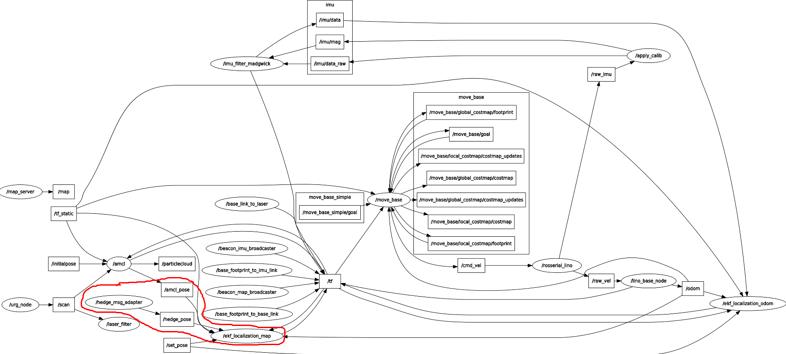

   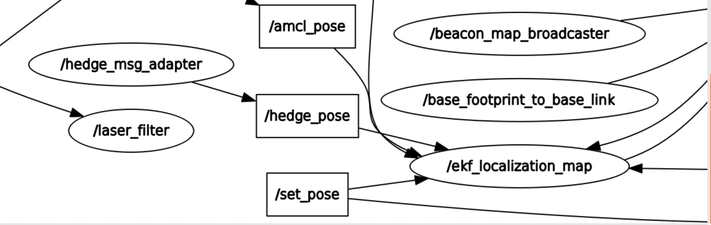


CH3EERS!

```
                            .     .
                         .  |\-^-/|  .    
                        /| } O.=.O { |\     
```

​    

------

 [.png)](https://www.buymeacoffee.com/methylDragon)
