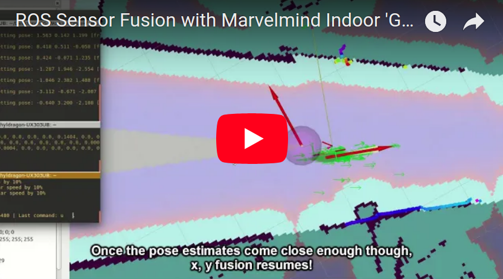

# Sensor Fusion in ROS

An in-depth step-by-step tutorial for implementing sensor fusion with extended Kalman filter nodes from robot_localization! Basic concepts like covariance and Kalman filters are explained here!

This tutorial is especially useful because there hasn't been a full end-to-end implementation tutorial for sensor fusion with the robot_localization package yet.

You can find the implementation in the Example Implementation folder!

### Why fuse sensor data

A lot of times, the individual navigation stack components in a robot application can fail more often than not, but together, they form a more robust whole than not.

One way to do this is with the extended Kalman filter from the [robot_localization](http://wiki.ros.org/robot_localization) package. The package features a relatively simple ROS interface to help you fuse and configure your sensors, so that's what we'll be using!

### How to use this tutorial

1. Make sure you're caught up on [ROS](https://github.com/methylDragon/coding-notes/tree/master/Robot%20Operating%20System%20(ROS)/ROS)
2. It'll be good to read the [Marvelmind Indoor 'GPS' beacon tutorial](https://github.com/methylDragon/marvelmind-indoor-gps-tutorial) alongside this if you want to understand the example implementation
3. Likewise for the [Linorobot stack](https://linorobot.org)
4. And [AMCL](http://wiki.ros.org/amcl)
5. Then go ahead and follow the tutorial in order!

------

 [.png)](https://www.buymeacoffee.com/methylDragon)